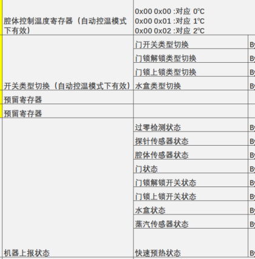
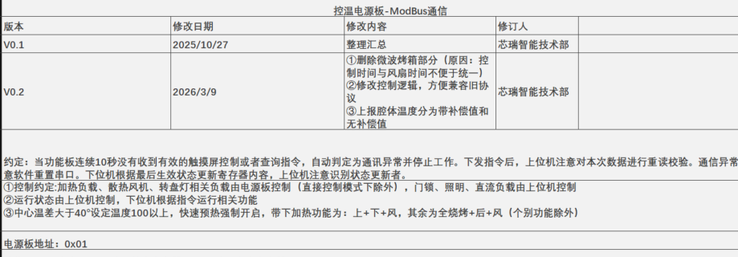
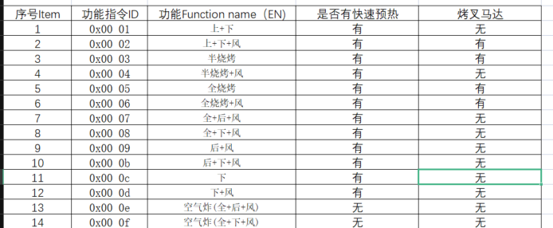
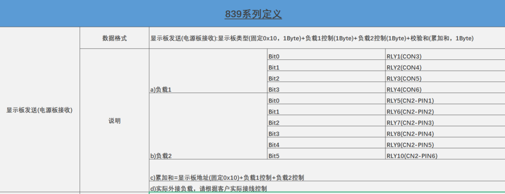
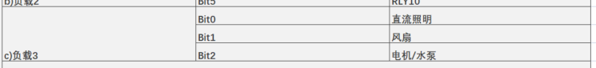
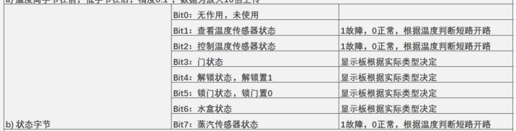
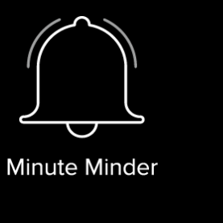
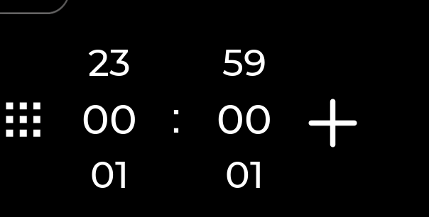
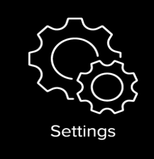

# 会议需求

## 协议部分
1. **电源板控温协议**: modbus协议的内容和UI不相符, UI界面并没有这些内容, 显示板是不是不用考虑, 如下
2. 

2. **功能说明**: 这些功能指令ID是什么, 显示板需要控制吗, 还是不需要显示板考虑

3. **显示板控温协议**: 这里的负载1和负载2是什么,每一位什么含义, 这个是不是不用modbus协议了, 就是自己组个包发出去就行了
只有这一包数据吗, 是心跳包定时发送, 然后电源板固定返回吗

- 这里的风扇和电机/水泵,UI并没有是不是不用考虑

- 这里返回的状态UI也没有对应的界面显示,电源板返回给显示板有什么用

## UI部分
1. 这里的闹钟有什么用, 协议也没有写发送什么相关的内容

2. 设置界面UI没给,是空的,跳转什么界面, 设置哪些内容, 协议如何上报

2. Recipes食谱界面点击了有什么用, 只有UI, 没有功能

4. Favourites偏好也要详细说明一下

5. 这两个界面一样, 只有UI, 没有功能, 协议又该怎么上传, 还是不用上传, 我这该怎么处理

6. 这些滚动图标, 具体有哪些模式, 怎么上传协议, 现在的名称和图标是我占位瞎设置的, 具体的功能需求没给
右边的Timer定时时间设置了怎么上传协议, 这些都没有

