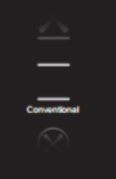
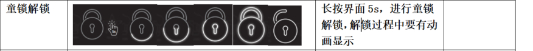
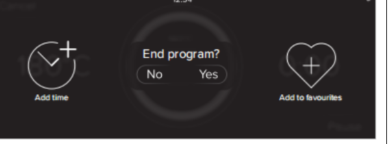

# 需求说明

> **需求一**: 半透明需求
这里上下有个半透明渐变的效果, 需要UI给个这种半透明渐变的蒙板
需要两处半透明渐变局部

---
-  蒙板分辨率: 480*150  
-  要求: 中间150原色,两端逐渐变淡,如图效果

---
- 蒙板分辨率: 100*200  
- 要求: 中间40原色,两端逐渐变淡,如图效果

---
> **需求二**: 动画切图需求
- 5秒动画,白色进度条从底部逐渐沿着灰色图标增加到顶部
- 图标分辨率: 231*338

> **需求三**: 图标缺少
- 下方左右两个图标缺失
- 图标分辨率要求: 200*200

