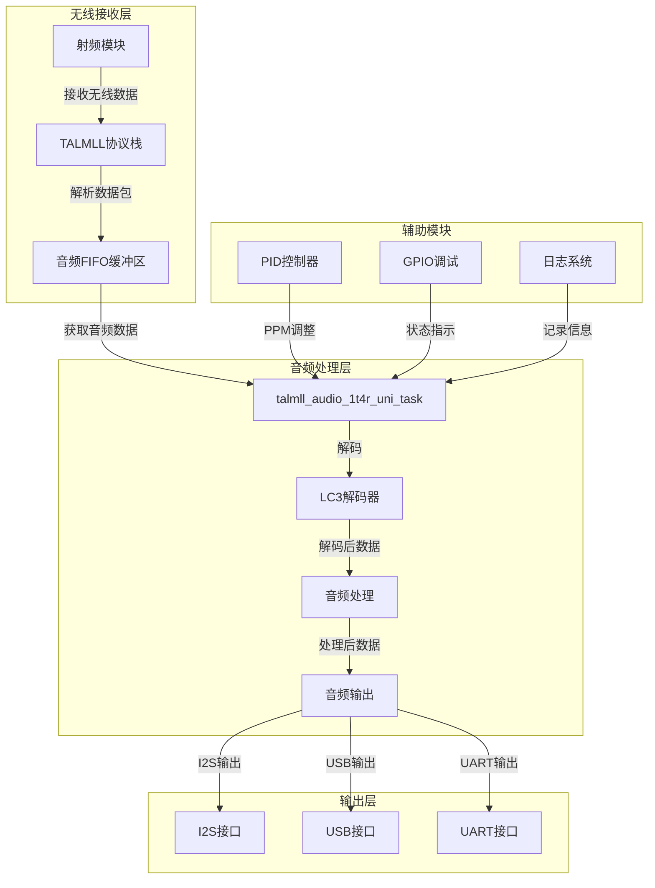

# 无线麦克风

[[音视频学习笔记]二、什么是PCM音频？一些常见的PCM处理](https://blog.csdn.net/Andius/article/details/136739875)

# USB UAC设备枚举与音频传输流程笔记

## 阶段一：枚举阶段（获取设备信息，分配地址）

| 步骤 | 主机发送 | 设备响应 | 说明 |
|------|----------|----------|------|
| 1 | 复位信号 | 无 | 主机复位总线，设备进入默认状态 |
| 2 | GET_DESCRIPTOR (Device) | 返回设备描述符 | 获取基本设备信息（USB版本、VID/PID等） |
| 3 | SET_ADDRESS | 返回ACK | 主机分配唯一地址，后续通信使用新地址 |
| 4 | GET_DESCRIPTOR (Device)（可选） | 返回设备描述符 | 确认地址生效 |
| 5 | GET_DESCRIPTOR (Configuration)（长度9） | 返回配置描述符头 | 获取配置总长度 |
| 6 | GET_DESCRIPTOR (Configuration)（全长） | 返回完整配置描述符集合 | 包含接口、端点、类特定描述符（音频控制、音频流接口、备用设置、格式等） |
| 7 | GET_DESCRIPTOR (String)（可选） | 返回字符串描述符 | 获取制造商、产品名等 |

## 阶段二：配置与初始化（设置接口，准备音频流）

| 步骤 | 主机发送 | 设备响应 | 说明 |
|------|----------|----------|------|
| 8 | SET_CONFIGURATION | 返回ACK | 激活配置，所有接口进入默认备用设置（Alternate Setting 0，无端点） |
| 9 | GET_CUR/SET_CUR（可选） | 返回/设置控制值 | 查询或设置音量、静音等控制项 |
| 10 | SET_CUR（采样频率） | 返回ACK | 设置采样率（如果设备支持多种） |
| 11 | SET_INTERFACE（Alternate Setting 1） | 返回ACK | 切换到工作接口，启用等时端点，准备音频流 |

## 阶段三：音频流传输（实时数据传输）

| 步骤 | 主机发送 | 设备响应 | 说明 |
|------|----------|----------|------|
| 12 | SOF令牌包（每1ms） | 无 | 提供时间基准，同步传输 |
| 13 | 等时OUT传输（主机→设备，扬声器）或 等时IN传输（设备→主机，麦克风） | 设备发送/接收音频数据包 | 每个帧传输一个音频帧（交织的PCM数据），无握手 |
| 14 | 中断传输（可选） | 设备上报控制事件 | 如音量旋钮变化，通过中断端点实时上报 |

## 关键点总结
- 枚举和配置均使用**控制传输**（端点0）。
- 音频数据使用**等时传输**，保证实时性但允许少量丢包。
- 备用设置0（无端点）用于空闲状态，不占用带宽。
- UAC 1.0 通过类特定描述符定义音频功能拓扑（终端、单元）。

