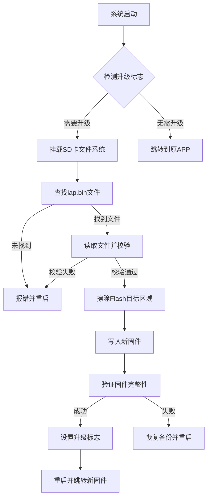
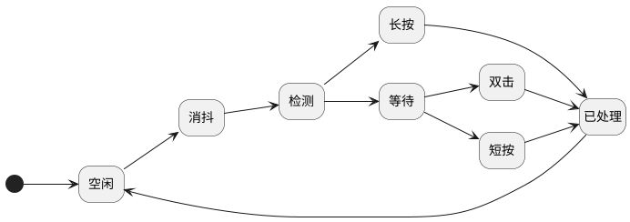
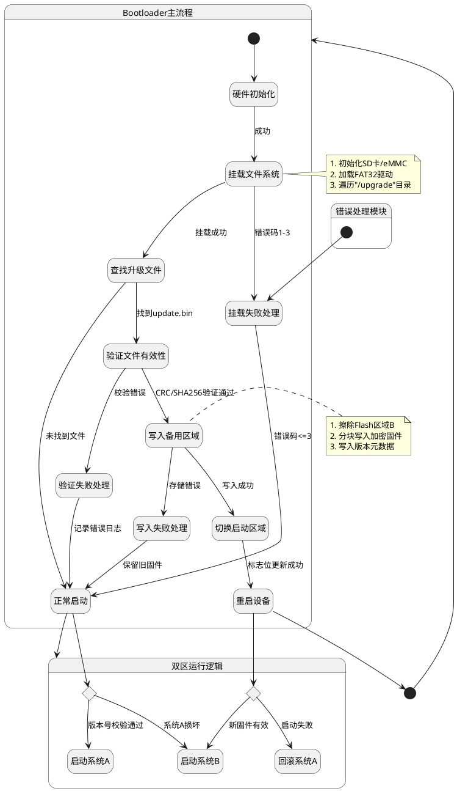

# IAP升级

---
1. 单片机发送查询升级命令到上位机,根据回应是否升级
2. 单片机上电等待一段时间,若接收到上位机信息,则进行升级

检测SD卡内文件
若存在弹窗
确定后打开定时器,

---

```mermaid
graph TD
    A[系统启动] --> B{检测升级标志}
    B -->|需要升级| C[挂载SD卡文件系统]
    B -->|无需升级| D[跳转到原APP]
    C --> E[查找iap.bin文件]
    E -->|找到文件| F[读取文件并校验]
    E -->|未找到| G[报错并重启]
    F -->|校验通过| H[擦除Flash目标区域]
    F -->|校验失败| G
    H --> I[写入新固件]
    I --> J[验证固件完整性]
    J -->|成功| K[设置升级标志]
    J -->|失败| L[恢复备份并重启]
    K --> M[重启并跳转新固件]
```

```puml
@startuml
left to right direction
hide empty description

[*] --> 空闲
空闲 --> 消抖
消抖 --> 检测
检测 --> 长按
检测 --> 等待
长按 --> 已处理
等待 --> 双击
等待 --> 短按
双击 --> 已处理
短按 --> 已处理
已处理 --> 空闲

@enduml
```

```puml
@startuml

@startuml
hide empty description

state 设备上电 <<start>>
state Bootloader主流程 {
  [*] --> 硬件初始化
  硬件初始化 --> 挂载文件系统: 成功
  挂载文件系统 --> 查找升级文件: 挂载成功
  挂载文件系统 --> 挂载失败处理: 错误码1-3

  查找升级文件 --> 验证文件有效性: 找到update.bin
  查找升级文件 --> 正常启动: 未找到文件
  
  验证文件有效性 --> 写入备用区域: CRC/SHA256验证通过
  验证文件有效性 --> 验证失败处理: 校验错误
  
  写入备用区域 --> 切换启动区域: 写入成功
  写入备用区域 --> 写入失败处理: 存储错误
  
  切换启动区域 --> 重启设备: 标志位更新成功
}

state 错误处理模块 {
  [*] --> 挂载失败处理
  挂载失败处理 --> 正常启动: 错误码<=3
  验证失败处理 --> 正常启动: 记录错误日志
  写入失败处理 --> 正常启动: 保留旧固件
}

state 双区运行逻辑 {
  state 主区域运行 <<choice>>
  state 备用区域运行 <<choice>>
  
  正常启动 --> 主区域运行
  主区域运行 --> 启动系统A: 版本号校验通过
  主区域运行 --> 启动系统B: 系统A损坏
  
  重启设备 --> 备用区域运行
  备用区域运行 --> 启动系统B: 新固件有效
  备用区域运行 --> 回滚系统A: 启动失败
}

设备上电 --> Bootloader主流程
正常启动 --> 双区运行逻辑
重启设备 --> 设备上电

note right of 挂载文件系统
1. 初始化SD卡/eMMC
2. 加载FAT32驱动
3. 遍历"/upgrade"目录
end note

note left of 写入备用区域
1. 擦除Flash区域B
2. 分块写入加密固件
3. 写入版本元数据
end note
@enduml

@enduml
```

