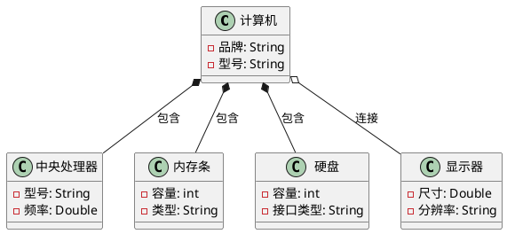

## 工作任务
1. 泰凌微-蓝牙BLE音频麦克风收发降噪
2. 测试架
3. 1.6寸旋钮屏幕
4. 匠芯创-床头屏

---

```puml
@startuml
class 计算机 {
  -品牌: String
  -型号: String
}

class 中央处理器 {
  -型号: String
  -频率: Double
}

class 内存条 {
  -容量: int
  -类型: String
}

class 硬盘 {
  -容量: int
  -接口类型: String
}

class 显示器 {
  -尺寸: Double
  -分辨率: String
}

计算机 *-- 中央处理器 : 包含
计算机 *-- 内存条 : 包含
计算机 *-- 硬盘 : 包含
计算机 o-- 显示器 : 连接
@enduml
```