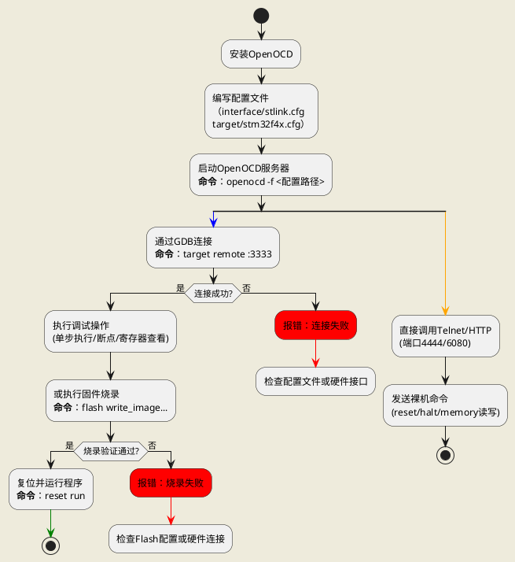

# OpenCAD

## 1. 基础概念
- **定义**：OpenOCD（Open On-Chip Debugger）是一个开源的调试工具，支持JTAG/SWD接口的芯片调试和编程。
- **核心功能**：
  - 芯片调试（GDB集成）
  - Flash编程（烧录固件）
  - 硬件边界扫描（JTAG）
- **硬件接口**：
  - JTAG（联合测试行动组）
  - SWD（串行线调试）
  - cJTAG（压缩JTAG）
- **相关工具**：
  - GDB（调试器）
  - ST-Link/J-Link（调试探针）

## 2. 安装与配置
- **安装方法**：
  - Linux: `sudo apt-get install openocd`
  - Windows: 从官网下载预编译包
  - macOS: `brew install openocd`
- **配置文件**：
  - 调试探针配置（`interface/`目录，如`stlink.cfg`）
  - 目标芯片配置（`target/`目录，如`stm32f4x.cfg`）
- **启动命令**：
  ```bash
  openocd -f interface/stlink.cfg -f target/stm32f4x.cfg
  ```

