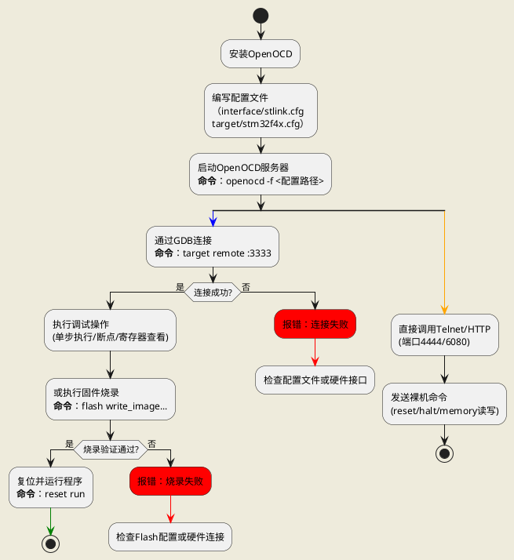

# OpenCAD

## 1. 基础概念
- **定义**：OpenOCD（Open On-Chip Debugger）是一个开源的调试工具，支持JTAG/SWD接口的芯片调试和编程。
- **核心功能**：
  - 芯片调试（GDB集成）
  - Flash编程（烧录固件）
  - 硬件边界扫描（JTAG）
- **硬件接口**：
  - JTAG（联合测试行动组）
  - SWD（串行线调试）
  - cJTAG（压缩JTAG）
- **相关工具**：
  - GDB（调试器）
  - ST-Link/J-Link（调试探针）

## 2. 安装与配置
- **安装方法**：
  - Linux: `sudo apt-get install openocd`
  - Windows: 从官网下载预编译包
  - macOS: `brew install openocd`
- **配置文件**：
  - 调试探针配置（`interface/`目录，如`stlink.cfg`）
  - 目标芯片配置（`target/`目录，如`stm32f4x.cfg`）
- **启动命令**：
  ```bash
  openocd -f interface/stlink.cfg -f target/stm32f4x.cfg
  ```




**详细过程**：
1.  **策略注入**：Keil调试框架将.FLM算法文件作为二进制“策略”加载到目标芯片的RAM中。
2.  **参数传递**：框架向FLM代码传递操作参数（命令、地址、数据）。
3.  **模板执行**：框架按照固定模板，依次调用FLM中的`Init`、`Erase`、`Program`、`Verify`等函数。
4.  **策略实现**：每个FLM函数内部包含针对该芯片Flash控制器的专属操作代码（如写特定寄存器序列）。
5.  **完成清理**：操作完成后，框架控制芯片复位，RAM中的FLM代码被清除。

### 2.3 架构优势
*   **解耦**：调试器驱动只需通用加载功能，无需知晓具体芯片细节。
*   **安全**：Flash操作在芯片RAM中运行，失败通常不会导致调试器连接丢失（不易“变砖”）。
*   **生态**：芯片厂商负责提供优化的.FLM文件，保证可靠性和性能。

---

# Keil与OpenOCD下载流程及架构完全解析

## 1. Keil MDK 标准下载/烧录流程详解

### 1.1 完整流程步骤
当在Keil中编译工程后，点击“Download”（烧录）按钮，完整的硬件操作流程如下：

1.  **用户发起操作与工具调用**
    *   用户点击Keil IDE的“Load”或“Download”按钮。
    *   Keil IDE本身不直接操作硬件，而是根据工程配置，调用外部编程工具（如ST-Link Utility的命令行工具、JLink.exe或OpenOCD）。

2.  **建立物理连接与握手**
    *   被调用的编程工具通过调试器（如ST-Link, J-Link）和物理接口（JTAG/SWD）连接目标单片机。
    *   发送特定信号序列，使芯片从用户模式切换到调试模式。
    *   读取芯片内部的IDCODE，验证芯片型号与工程配置是否匹配。

3.  **芯片擦除**
    *   在写入新程序前，擦除芯片内部Flash的相应区域。模式包括：
        *   **全片擦除**：清除整个Flash。
        *   **扇区擦除**：仅擦除程序占用的扇区，可保留其他数据。

4.  **编程与校验**
    *   **编程**：编程工具将Keil生成的可执行文件（.axf, .hex, .bin）按照Flash时序，写入芯片的指定起始地址（如Cortex-M芯片通常是0x08000000）。
    *   **校验**：写入完成后，重新读取Flash内容，与原始文件逐字节对比，确保无误。

5.  **复位与运行**
    *   编程工具通过调试接口发送硬件复位或软复位命令。
    *   芯片复位后，从复位向量表中取出新的程序入口地址，开始执行刚下载的程序。

### 1.2 关键配置与常见问题排查

| 步骤         | 可能的问题                 | 排查方法                                                                 |
| :----------- | :------------------------- | :----------------------------------------------------------------------- |
| **配置**     | 调试器类型选错             | 检查 `Options for Target -> Debug` 是否选择正确的调试器。                |
| **连接**     | 硬件连接不通或驱动未安装   | 检查连线、电源；在设备管理器确认调试器驱动正常；在Keil设置中尝试识别芯片ID。 |
| **擦除/编程**| Flash算法错误或芯片写保护  | 检查 `Options for Target -> Flash Download` 是否添加了对应芯片的.FLM算法文件；若写保护需用专用工具解除。 |
| **复位**     | 下载后未自动运行           | 在 `Utilities -> Settings` 中勾选“Reset and Run”。                       |

---

## 2. Keil的.FLM下载算法架构解析（类比设计模式）

### 2.1 核心架构理解
Keil的.FLM下载机制融合了“模板方法模式”和“策略模式”的思想。

*   **模板方法模式 (Template Method)**：
    *   **体现**：Keil MDK的调试框架定义了**固定不变的烧录算法骨架**。
    *   **流程**：初始化 -> 擦除 -> 编程 -> 校验 -> 结束。这个顺序对所有芯片通用。

*   **策略模式 (Strategy)**：
    *   **体现**：针对不同芯片的、具体的 **.FLM文件** 就是可互换的“策略”。
    *   **执行**：框架在运行时将对应的.FLM文件（策略）加载到目标芯片RAM中执行，以完成芯片特定的擦写操作。

### 2.2 工作流程示意 (序列图)

**详细过程**：
1.  **策略注入**：Keil调试框架将.FLM算法文件作为二进制“策略”加载到目标芯片的RAM中。
2.  **参数传递**：框架向FLM代码传递操作参数（命令、地址、数据）。
3.  **模板执行**：框架按照固定模板，依次调用FLM中的`Init`、`Erase`、`Program`、`Verify`等函数。
4.  **策略实现**：每个FLM函数内部包含针对该芯片Flash控制器的专属操作代码（如写特定寄存器序列）。
5.  **完成清理**：操作完成后，框架控制芯片复位，RAM中的FLM代码被清除。

### 2.3 架构优势
*   **解耦**：调试器驱动只需通用加载功能，无需知晓具体芯片细节。
*   **安全**：Flash操作在芯片RAM中运行，失败通常不会导致调试器连接丢失（不易“变砖”）。
*   **生态**：芯片厂商负责提供优化的.FLM文件，保证可靠性和性能。

---

## 3. OpenOCD下载流程与架构详解

### 3.1 核心架构对比
OpenOCD采用与Keil完全不同的 **“直接命令控制”** 架构。

| 特性         | Keil + .FLM算法                          | OpenOCD                                      |
| :----------- | :--------------------------------------- | :------------------------------------------- |
| **架构哲学** | **托管执行** (在目标RAM中运行算法)        | **直接控制** (主机直接发送硬件命令)           |
| **执行核心** | 在**目标芯片RAM**中运行的.FLM程序         | 运行在**主机**上的OpenOCD软件及其驱动         |
| **知识封装** | 独立于调试器的.FLM二进制文件              | 目标芯片的.cfg配置文件及内置的Flash驱动命令   |
| **灵活性**   | 依赖厂商提供，用户难以修改                | 开源，可高度定制和编写驱动                    |

### 3.2 OpenOCD下载流程与文件职能

**流程概述**：

**核心配置文件及其作用**：

| 文件类型/路径        | 典型例子                | 核心职能与作用                                                                                                                               |
| :------------------- | :---------------------- | :----------------------------------------------------------------------------------------------------------------------------------------- |
| **接口配置**         | `interface/stlink.cfg`  | **定义与调试器的通信**。指定调试器型号、传输协议(JTAG/SWD)、速度、USB参数。是OpenOCD与物理世界的桥梁。                                          |
| `interface/`         | `jlink.cfg`             |                                                                                                                                            |
| **目标芯片配置**     | `target/stm32f1x.cfg`   | **定义CPU内核和片上外设**。这是最核心的文件，其中包含了：                                                                                      |
| `target/`            |                         | 1. **CPU类型** (如`cortex_m`)。                                                                                                            |
|                      |                         | 2. **内存映射** (Flash/RAM地址大小)。                                                                                                       |
|                      |                         | 3. **内嵌的Flash驱动**：通过`flash bank`命令声明，包含了操作该芯片Flash控制器的全部命令序列（如解锁、擦除、编程的寄存器操作）。                    |
| **板级配置**         | `board/` 目录下文件     | **组合接口与目标配置**。为特定开发板提供开箱即用的完整配置，包括复位电路、时钟、外部存储器等板级特定设置。                                         |
| `board/`             |                         |                                                                                                                                            |
| **用户/项目配置**    | `openocd.cfg` 或命令行  | **总装配文件**。通过`source [find file.cfg]`命令链式加载上述配置，并添加自定义命令。是整个OpenOCD会话的入口。                                    |

### 3.3 OpenOCD Flash驱动工作原理解析

在`target/stm32f1x.cfg`中，关键命令示例：
*   `stm32f1x`：这就是Flash驱动名称，对应OpenOCD源码中的一个驱动程序（如`stm32f1x.c`）。
*   该驱动内硬编码了STM32F1系列Flash控制器的所有**寄存器地址**和**标准操作序列**。

**当执行`program`命令时**：
1.  OpenOCD根据地址找到对应的`flash bank`和驱动（`stm32f1x`）。
2.  驱动内部的函数被调用，生成针对该芯片的**JTAG/SWD内存读写命令序列**。
3.  这些命令通过调试器直接发送给芯片，操作Flash控制器寄存器（如`FLASH_CR`、`FLASH_SR`），完成解锁、擦除、编程、校验全过程。
4.  **所有逻辑均在主机上运行**，调试器仅作为“命令传输通道”，芯片是被动的“硬件设备”。

---

## 4. 总结：两种工具的架构哲学

1.  **Keil MDK (+ .FLM)**：
    *   **比喻**：请专业的**临时工（FLM算法）**到车间（芯片RAM），按照标准作业书操作机器（Flash）。
    *   **特点**：稳定、易用、安全，由芯片厂商优化，但封闭且依赖性强。

2.  **OpenOCD**：
    *   **比喻**：一个**精通机器原理的老师傅**，站在车间外通过遥控器（调试接口）直接操作机器的每一个按钮（寄存器）。
    *   **特点**：灵活、开源、底层透明，可深度定制，但配置相对复杂，需要对硬件有较好理解。

**关键启示**：
*   `.FLM`机制是**模板方法模式**和**策略模式**在嵌入式工具中的经典应用，实现了通用流程与具体芯片操作的解耦。
*   OpenOCD的**模块化配置**和**直接控制**架构，体现了开源工具的灵活性和对硬件底层的掌控能力。
*   选择哪种工具取决于需求：追求稳定、快速开发选Keil；追求成本控制、深度定制或学习底层选OpenOCD。


### 4.1 OpenOCD配置文件详解
OpenOCD采用分层、模块化的配置架构，核心思想是：**创建对象（Create） → 配置对象（Configure）**。


### 4.2 核心配置文件及其作用
| 文件类型/路径        | 典型例子                | 核心职能                                                                                                                               |
| :------------------- | :---------------------- | :------------------------------------------------------------------------------------------------------------------------------------- |
| **接口配置**         | `interface/stlink.cfg`  | **定义与调试器的通信**。指定调试器型号、传输协议(JTAG/SWD)、速度、USB参数。是OpenOCD与物理世界的桥梁。                                 |
| `interface/`         | `jlink.cfg`             |                                                                                                                                        |
| **目标芯片配置**     | `target/stm32f4x.cfg`   | **定义CPU内核和片上外设**。这是最核心的文件，包含了CPU类型、内存映射和内嵌的Flash驱动（通过`flash bank`命令声明）。                     |
| `target/`            |                         |                                                                                                                                        |
| **板级配置**         | `board/` 目录下文件     | **组合接口与目标配置**。为特定开发板提供开箱即用的完整配置，包括复位电路、时钟、外部存储器等板级特定设置。                               |
| `board/`             |                         |                                                                                                                                        |
| **用户/项目配置**    | `openocd.cfg` 或命令行  | **总装配文件**。通过`source [find file.cfg]`命令链式加载上述配置，并添加自定义命令。是整个OpenOCD会话的入口。                            |

### 4.3 核心对象：创建与配置
以`stm32f4x.cfg`为例，其核心是创建和配置一系列对象：

#### 1. **SWJ-DP调试端口**
```tcl
swj_newdap $_CHIPNAME cpu -expected-id $_CPUTAPID
作用：创建芯片的物理调试端口对象，是后续所有通信的基础。
注意：$_CPUTAPID是芯片的硬件ID，用于验证连接。

dap create $_CHIPNAME.dap -chain-position $_CHIPNAME.cpu
作用：创建DAP（Debug Access Port）对象，它是OpenOCD与芯片通信的唯一桥梁，负责所有内存、寄存器访问和调试控制。
注意：DAP对象必须绑定到之前创建的SWJ-DP端口。

target create $_TARGETNAME cortex_m -dap $_CHIPNAME.dap
作用：创建用户可操作的CPU目标对象。_TARGETNAME是用户所有命令的接收者，相当于芯片的“遥控器”。

$_TARGETNAME configure -work-area-phys 0x20000000 -work-area-size $_WORKAREASIZE
$_TARGETNAME configure -event reset-init { ... }
-work-area-*：设置RAM工作区，用于Flash编程缓存。
-event：注册事件回调，如reset-init在芯片复位后自动执行。

flash bank $_FLASHNAME stm32f2x 0 0 0 0 $_TARGETNAME
作用：声明芯片的Flash，并关联到目标。stm32f2x是Flash驱动名称，包含了操作该芯片Flash控制器的所有命令。
注意：最后一个参数$_TARGETNAME指明了该Flash属于哪个CPU目标。

tpiu create $_CHIPNAME.tpiu -dap $_CHIPNAME.dap -ap-num 0 -baseaddr 0xE0040000
作用：创建跟踪端口接口单元，用于芯片执行跟踪和性能分析。
注意：通常需要配置预启用过程来初始化跟踪引脚。


```

# 正确顺序：
swj_newdap $_CHIPNAME cpu ...          # 1. 创建硬件端口
dap create $_CHIPNAME.dap ...          # 2. 创建DAP，依赖上面的端口
target create $_TARGETNAME ... -dap $_CHIPNAME.dap  # 3. 创建目标，依赖DAP
$_TARGETNAME configure -event ...      # 4. 配置目标事件

# 错误顺序（会导致失败）：
target create $_TARGETNAME ... -dap $_CHIPNAME.dap  # 错误！DAP还不存在
dap create $_CHIPNAME.dap ...