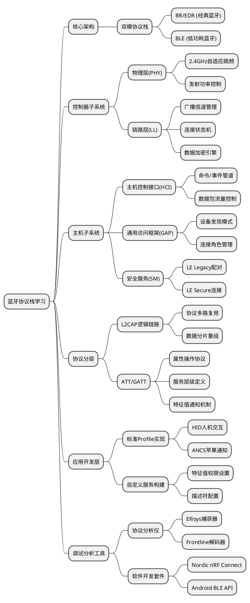

# BLE协议栈

```puml
@startmindmap
* 蓝牙协议栈学习
** 核心架构
	*** 双模协议栈
		**** BR/EDR (经典蓝牙)
		**** BLE (低功耗蓝牙)

** 控制器子系统
	*** 物理层(PHY)
		**** 2.4GHz自适应跳频
		**** 发射功率控制
	*** 链路层(LL)
		**** 广播信道管理
		**** 连接状态机
		**** 数据加密引擎

** 主机子系统
	*** 主机控制接口(HCI)
		**** 命令/事件管道
		**** 数据包流量控制
	*** 通用访问框架(GAP)
		**** 设备发现模式
		**** 连接角色管理
	*** 安全服务(SM)
		**** LE Legacy配对
		**** LE Secure连接

** 协议分层
	*** L2CAP逻辑链路
		**** 协议多路复用
		**** 数据分片重组
	*** ATT/GATT
		**** 属性操作协议
		**** 服务层级定义
		**** 特征值通知机制

** 应用开发层
	*** 标准Profile实现
		**** HID人机交互
		**** ANCS苹果通知
	*** 自定义服务构建
		**** 特征值权限设置
		**** 描述符配置

** 调试分析工具
	*** 协议分析仪
		**** Ellisys捕获器
		**** Frontline解码器
	*** 软件开发套件
		**** Nordic nRF Connect
		**** Android BLE API
@endmindmap
```

**蓝牙的五种状态:**
