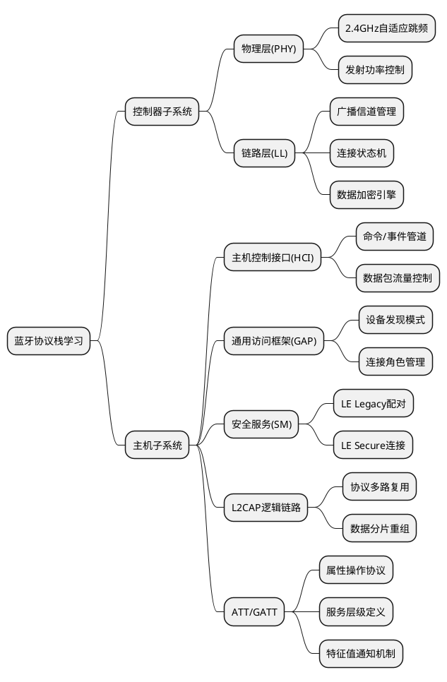

# 一、BLE整体架构
> [一文搞定蓝牙基础及蓝牙协议栈](https://blog.csdn.net/qq_52815427/article/details/148256512)
> [Nordic-nRF54L 系列架构全景：从蓝牙 6.0 到超低功耗设计详解](https://blog.csdn.net/wotaifuzao/article/details/155892613?ops_request_misc=%257B%2522request%255Fid%2522%253A%25220639162f6bcde045e2e5d1989a2ccd96%2522%252C%2522scm%2522%253A%252220140713.130102334.pc%255Fblog.%2522%257D&request_id=0639162f6bcde045e2e5d1989a2ccd96&biz_id=0&utm_medium=distribute.pc_search_result.none-task-blog-2~blog~first_rank_ecpm_v1~rank_v31_ecpm-12-155892613-null-null.nonecase&utm_term=BLE&spm=1018.2226.3001.4450)
> [音频相关基础知识（采样率、位深度、通道数、PCM、AAC）](https://blog.csdn.net/qq_41824928/article/details/108124382)
> [08.BLE L2CAP技术全解析：从入门到精通](https://zhuanlan.zhihu.com/p/1984765090533236889)
> [实测对比Wireshark利用nRF52832抓包和Packet Sniffer抓包使用体验](https://zhuanlan.zhihu.com/p/139675278)

- **蓝牙开发岗位分为三类**:
 `蓝牙BSP开发`: 根据蓝牙协议栈的Control接口适配自家的芯片硬件平台
`蓝牙协议栈开发`:根据<mark>蓝牙规范手册</mark>编写协议栈算法和无线通信代码实现,各厂家会在蓝牙规范的框架下根据各自的`目标应用`和`芯片平台`做特定的优化
`蓝牙应用开发`: 根据<mark>蓝牙规范手册</mark>和对应的<mark>BLE协议栈</mark>实现对应的应用开发,如GATT, Mesh, CoC, LE Audio, AoA

- **常用蓝牙协议栈**:

|      Android       | Linux |  Zephyr   | RTOS | 蓝牙芯片厂 |
| ------------------ | ----- | --------- | ---- | --------- |
| Bluedroid/Fluoride | BlueZ | ZephyrBLE |  NimBLE    | 自研协议栈 |




# 二、蓝牙BLE信道总结

- **信道总数**：40个
- **频段**：2.4GHz ISM频段（2.400 GHz - 2.4835 GHz）
- **广播信道**：3个，用于设备发现、连接建立和广播数据
- **数据信道**：37个，用于连接后的双向数据传输


# 三、蓝牙BLE物理层: 状态概括
- 物理层模式定义了无线通信的调制方式和数据速率，主要有以下三种：

| 模式              | 数据速率              | 主要特点                                                    |
| :--------------- | :------------------- | :--------------------------------------------------------- |
| **LE 1M PHY**    | 1 Mbps               | 标准模式，传输距离约100米，最常用。                            |
| **LE 2M PHY**    | 2 Mbps               | 高速模式，吞吐量更高，传输距离稍短。                           |
| **LE Coded PHY** | 125 kbps 或 500 kbps | 编码模式，支持前向纠错 (FEC)，传输距离可达1000米，抗干扰能力强。 |

- 射频状态描述了底层射频电路的实际开关状态，是BLE实现超低功耗的硬件基础。主要有三种状态
- 因为蓝牙底层只能同时处于其中一种状态, 所以蓝牙协议是半双工的,只是协议栈的复杂调度机制让外部看起来是全双工
1.  **发射状态 (TX)**
    *   **描述**：射频电路开启，并向外发射无线信号。
    *   **功耗**：**最高**。电流通常在几mA到二十几mA级别。
    *   **活动时机**：仅在需要发送数据包的极短时间内激活（例如，发送一个广播包约需0.6-1.2ms）。

2.  **接收状态 (RX)**
    *   **描述**：射频电路开启，并监听无线信道，准备接收信号。
    *   **功耗**：**高**，通常略低于或接近TX状态。
    *   **活动时机**：在监听广播或连接事件中等待接收数据时激活。

3.  **休眠状态 (Sleep)**
    *   **描述**：射频电路完全关闭。
    *   **功耗**：**极低**。电流可低至1μA甚至nA级别。
    *   **活动时机**：设备在**绝大部分时间**都处于此状态。
---

-  核心功耗原理
BLE设备采用 **“事件驱动”的间歇工作模式**：
1.  设备在`Sleep`状态下等待下一次通信事件（如广播间隔或连接间隔）。
2.  在精确计算的时间点，设备快速唤醒，切换到`TX`或`RX`状态，在极短的窗口内完成数据包的发送或接收。
3.  通信完成后，设备立即返回`Sleep`状态，直到下一个事件到来。
---


# 四、蓝牙BLE链路层：五状态状态机

## 1. 五种基本状态
蓝牙低功耗（BLE）链路层的所有行为都基于一个核心的**五状态状态机**。任一时刻，设备链路层必处于且仅处于以下一种状态。

| 状态名称 (英文)   | 状态名称 (中文) | 核心职责与描述                                                                                       |
| :-------------- | :------------- | :------------------------------------------------------------------------------------------------- |
| **Standby**     | 待机            | **默认状态**。不发送也不接收任何数据包，功耗极低。是其他所有状态的起点和终点。                             |
| **Advertising** | 广播            | **向外宣告自身存在**。周期性在3个广播信道上发送数据包。**外围设备**（如传感器）必须进入此状态才能被连接。    |
| **Scanning**    | 扫描            | **监听外界广播**。在广播信道上监听，接收并解析来自广播者的数据包。**中央设备**（如手机）通过此状态发现设备。 |
| **Initiating**  | 发起            | **主动发起连接**。在监听到目标设备的特定广播后，向该设备发出直接的连接请求。                               |
| **Connection**  | 连接            | **已建立专用链路**。两个设备间已形成一条时序同步的专用数据通道，可进行可靠的双向数据通信。                  |

## 2. 状态机流程图解析


*   **中心节点**：**Standby（待机）** 是状态机的核心枢纽，是进入或退出其他状态的公共入口/出口。
*   **双向转换**：Standby 与 Scanning、Advertising、Initiating 之间均为**双向箭头**，表示可以自由进入和退出这些状态。
*   **关键转换路径**：
    1.  **进入连接的唯一路径**：**Connection（连接）状态只能从 Advertising 或 Initiating 状态进入**。
        *   这反映了连接建立的真实过程：一个设备在广播，另一个设备对其发起连接。
    2.  **Advertising 与 Initiating 间的联系**：两者之间有一条直接的弧形转换路径，表明角色或模式可以切换。
*   **角色映射**：
    *   **外围设备角色链**：`Standby <-> Advertising -> Connection`
    *   **中央设备角色链**：`Standby <-> Scanning <-> Initiating -> Connection`

## 3. 状态转换核心规则总结
1.  **起点与终点**：**Standby** 是所有操作的起始点和休眠点。
2.  **连接建立**：必须通过 **Advertising**（广播方）和 **Initiating**（发起方）的交互才能进入 **Connection** 状态。
3.  **角色分离**：
    *   通常，**外围设备** 操作 `Advertising` 和 `Connection` 状态。
    *   通常，**中央设备** 操作 `Scanning`、`Initiating` 和 `Connection` 状态。
4.  **连接中的转换**：设备处于 **Connection** 状态时，仍可转换回 **Advertising** 或 **Initiating** 状态以执行广播或扫描等操作（例如，在连接的同时进行广播）。

## 4. 与协议栈其他部分的关系
*   **与物理层**：链路层的每个状态都对应着物理层射频电路的具体行为模式（如发射、接收、休眠）。
*   **与GAP**：GAP层定义的设备角色（外围设备、中央设备）和操作模式（可发现、可连接），最终是通过控制链路层在这些状态之间进行转换来实现的。例如，GAP的 `startAdvertising()` API 会命令链路层从 Standby 进入 Advertising 状态。


**结论**：这五个状态及其转换规则，构成了BLE设备所有无线交互（发现、广播、连接、通信）的**最底层逻辑基础**，是理解蓝牙BLE工作机制的核心。


# 五、蓝牙BLE的LL层与L2CAP层状态机对比

## 1. 核心区别
- **LL层**：管理**物理射频连接**的状态，设备全局唯一状态
- **L2CAP层**：集中式信令处理 + 分布式信道管理, L2CAP层全局共享一个信令通道状态机, 信令通道状态机解析后分发给对应的信道状态机, 管理**逻辑信道**的状态，每个信道独立状态管理


## 2. LL层状态机（5种状态）

| 状态 | 描述 | 主要功能 |
|------|------|----------|
| **Standby** | 待机状态 | 设备未进行任何射频活动，可接收命令进入其他状态 |
| **Advertising** | 广播状态 | 发送广播包，允许被扫描设备发现 |
| **Scanning** | 扫描状态 | 监听广播包，发现周围广播设备 |
| **Initiating** | 发起状态 | 接收广播包后发起连接请求 |
| **Connected** | 连接状态 | 已建立连接，可进行数据通信（分为Master/Slave角色） |

**特点**：
- 设备在某一时刻只能处于一种LL状态
- 管理物理连接的建立、维护和断开
- 状态转换由协议事件触发

## 3. L2CAP状态机

### 基本概念：
- L2CAP**没有**像LL层那样的统一5种状态机
- 每个L2CAP通道（Channel）有自己的独立生命周期状态机
- 一个物理连接上可同时存在多个L2CAP通道


### 1. 信令通道状态机（全局唯一，共享）
- **角色**：全局的“交通指挥中心”，负责所有控制信令的解析与路由。
- **数量**：整个 L2CAP 层仅有一个实例。
- **核心职责**：
  - 接收和发送所有 L2CAP 信令包（如连接、配置、断开请求）。
  - 解析信令包，提取目标**信道标识符（CID）** 和事件类型。
  - 根据 CID 将事件**路由**到对应的信道状态机实例。
  - 不管理具体信道的生命周期，仅确保信令的可靠传输和事件分发。

### 2. 信道状态机（每个信道独立实例）
- **角色**：信道的“专属管家”，管理特定信道的完整生命周期。
- **数量**：每个逻辑信道（CID）都有一个独立的实例，动态创建/销毁。
- **核心职责**：
  - 接收信令通道状态机转发的、属于本信道的事件。
  - 根据当前状态和输入事件，执行动作（如准备数据、发送响应）并进行状态转换。
  - 管理信道从 CLOSED → 连接 → 配置 → OPEN → 断开 → CLOSED 的全过程。
- **关键特性**：所有信道状态机实例共享**同一套状态转换规则**（同一“模板”），但各自独立运行，状态和上下文隔离。

#### 经典蓝牙L2CAP通道状态（每个通道）：

| 状态 | 描述 | 触发条件 |
|------|------|----------|
| **CLOSED** | 初始和最终状态 | 通道未建立，无资源分配 |
| **CONFIG** | 配置状态 | 通道参数协商（MTU、刷新超时等） |
| **OPEN** | 开放状态 | 配置完成，可收发数据 |
| **WAIT_DISCONNECT** | 等待断开 | 已发送断开请求，等待确认 |

**状态转换流程**：
CLOSED → CONFIG → OPEN → WAIT_DISCONNECT → CLOSED
（连接请求） （配置完成） （断开请求） （确认断开）

#### BLE L2CAP（LE Credit-Based Flow Control）：
- 采用基于信用的流控制模式
- 通道建立通过`LE Credit Based Connection Request/Response`一次性完成
- 通过信用值（Credit）控制数据流
- 状态更简化，无复杂配置状态

### 4. 对比总结

| 特性 | LL层状态机 | L2CAP状态机 |
|------|-----------|------------|
| **管理对象** | 整个设备的物理连接 | 每个独立的逻辑通道 |
| **状态类型** | 设备全局唯一状态 | 通道级独立状态 |
| **状态数量** | 5种固定状态 | 每个通道3-4种状态 |
| **主要功能** | 设备发现、连接建立 | 连接复用、数据分段重组 |
| **状态关系** | 互斥状态，同一时间只一种 | 多个通道可同时处于不同状态 |
| **简单理解** | 管理"是否连上" | 管理"连上后如何跑多个任务" |

### 5. 关键点总结
1. **层次不同**：LL层是物理层连接管理，L2CAP是逻辑链路控制
2. **状态粒度**：LL是设备级全局状态，L2CAP是通道级局部状态
3. **并发性**：一个LL连接上可运行多个L2CAP通道
4. **设计哲学**：LL层关注连接可靠性，L2CAP关注数据传输效率和多路复用

### 详细事件处理流程示例
1. **连接请求处理**：
   - 设备 A 通过信令通道发送 `L2CAP_ConnectReq`（指定目标 CID）。
   - 设备 B 的**信令通道状态机**接收并解析，提取 CID 和事件。
   - 信令通道状态机查找 CID 对应的**信道状态机实例**（若不存在则创建新实例，初始状态 CLOSED）。
   - 将“连接请求”事件传递给该信道状态机实例。
   - 信道状态机处理事件，执行动作（如发送连接响应），并转换状态（如进入 CONFIG）。
   - 需要回复时，信道状态机将回复信令交还信令通道状态机发送。

2. **数据传输**：仅在 OPEN 状态允许应用数据交换。

3. **断开连接**：
   - 类似过程，事件经信令通道状态机路由到目标信道状态机。
   - 信道状态机转换到 WAIT_DISCONNECT 等状态，最终回到 CLOSED 并可能销毁实例。

#### 关键要点总结
- **事件驱动**：所有状态转换均由事件触发（如接收信令、定时器超时）。
- **OPEN 是唯一数据传输状态**：其他状态均为建立、配置或释放的过渡态。
- **状态机实例化**：每个面向连接的逻辑信道在收到 `L2CAP_ConnectReq` 时会创建一个独立的状态机实例。
- **配置协商复杂性**：CONFIG 状态涉及多轮参数协商，确保双方兼容（MTU、流控等）。
- **多路复用基础**：此架构支持多个逻辑信道在单个物理链路上并发运行，相互隔离。
- **可靠性**：信令通道与信道管理分离，一个信道的故障不影响其他信道。

#### 核心价值
这种“一个全局路由器 + 多个本地管家”的设计实现了：
- **高效信令处理**：集中式信令解析提高效率。
- **信道隔离**：每个信道状态独立，增强系统稳健性。
- **灵活扩展**：动态信道创建，支持多样化的蓝牙应用场景。

---


# 六、蓝牙BLE广播状态详解

## 核心结论
**BLE设备在广播状态下，既能周期性发送广播数据，也能接收其他设备发起的连接请求。** 这通过**时分复用**技术实现。

## 工作机制
### 1. 广播与监听交替进行
- BLE设备并非持续发射信号
- 工作循环：**发送广播包 → 短暂监听窗口 → 发送广播包 → 短暂监听窗口...**
- 广播包在3个广播信道（37、38、39）上轮流发送

### 2. 连接建立过程
1. **广播阶段**：外设（Peripheral）发送广播包，包含设备信息、可连接标识
2. **扫描响应**：中心设备（Central，如手机）收到广播后，可发送扫描请求获取额外信息
3. **连接请求**：若中心设备决定连接，在广播设备的**监听窗口**内发送连接请求包
4. **信道切换**：双方根据连接请求包中的参数，从广播信道跳转到数据信道
5. **连接建立**：进入连接状态，开始双向通信

## 关键技术：时分复用
| 时间段 | 射频状态 | 功能 |
|--------|----------|------|
| 发送窗口（约0.1-10ms） | 发射模式 | 发送广播包 |
| 监听窗口（约0.1-0.3ms） | 接收模式 | 等待扫描请求或连接请求 |
| 空闲窗口 | 休眠/低功耗 | 节能 |

## 广播类型与连接性
| 广播类型 | 是否可连接 | 用途 |
|----------|------------|------|
| 可连接的非定向广播 | ✅ 是 | 最常见的广播，允许任何设备连接 |
| 可连接的定向广播 | ✅ 是 | 针对特定设备快速连接 |
| 不可连接的非定向广播 | ❌ 否 | 只广播数据，不接受连接 |
| 可发现非连接广播 | ❌ 否 | 仅用于被发现，不连接 |

## 协议层实现

# 七、蓝牙BLE的LL层与GAP关系总结

## 核心关系：分层与协作
蓝牙协议栈是分层的，LL与GAP是不同层级、职责分明的组件，共同完成连接管理。
*   **链路层**：位于**控制器**，是底层的“引擎”，直接驱动硬件（无线电、时序）。
*   **GAP**：位于**主机**，是高层的“驾驶手册”，定义设备交互的规范与接口。
*   **协作方式**：GAP向LL发出高级指令（如“开始扫描”），LL执行底层的物理操作（如控制无线电监听信道），两者通过HCI（主机控制器接口）通信。

## 主要区别
| 特性维度 | 链路层 | GAP |
| :--- | :--- | :--- |
| **层级** | 底层硬件驱动（控制器） | 高层协议/规范（主机） |
| **核心职责** | **“如何”连接**：处理物理数据包、信道时序、连接参数、加密解密。 | **“谁”以“什么流程”交互**：定义设备角色、发现与连接流程、安全模式、广播数据格式。 |
| **抽象程度** | 低，接近硬件（比特、时序）。 | 高，面向应用（角色、模式、策略）。 |
| **开发者可见度** | 通常由SDK/驱动实现，不可见。 | 直接通过API（如`startAdvertising`, `connect`）使用。 |

## 生动比喻
*   **链路层**：汽车的**发动机、变速箱、车轮**。负责执行“前进”、“加速”等基础物理动作。
*   **GAP**：**交通规则、驾照和导航**。规定行驶规则（角色）、变道信号（广播/扫描模式）、超车流程（连接建立）和目的地。

## 工作流程示例（设备A连接设备B）
1.  **GAP决策**：应用层指示GAP：“作为中央设备去连接。”
2.  **GAP调用LL**：GAP命令LL：“开始扫描（在3个广播信道上监听）。”
3.  **LL执行物理操作**：LL控制无线电接收数据包，将原始数据上报GAP。
4.  **GAP处理信息**：GAP解析数据，发现目标设备B。
5.  **GAP再次调用LL**：GAP命令LL：“向设备B的地址发起连接请求。”
6.  **LL建立物理链路**：LL与设备B的LL进行时序同步与数据交换，**物理连接建立**。之后，LL负责维持链路时序与数据传输。
7.  **GAP管理连接**：连接后，GAP管理连接参数更新、安全配对等高级逻辑，LL在物理层执行这些指令。

## 总结
*   **链路层** 负责在物理上 **“建立和维持”** 一条可靠的数据通道。
*   **GAP** 负责定义设备在通信中应扮演的 **角色** 和遵循的 **行为流程**。
*   开发者通过 **GAP的API** 来管理连接，GAP依赖 **LL** 来实现这些操作的物理基础。


# 八、蓝牙BLE ATT（属性协议）数据结构笔记

## ATT简介
ATT（Attribute Protocol，属性协议）是蓝牙低功耗（BLE）中用于设备间数据交换的基础协议，采用客户端/服务器架构。数据以属性的形式存储在服务器中，客户端通过属性句柄进行访问。它是GATT（通用属性规范）的底层基础。

## ATT属性数据结构
属性协议将数据组织为属性表（Attribute Table），每个属性包含以下四个核心组成部分：

| 组成部分 | 数据长度/格式 | 功能与说明 |
|:---|:---|:---|
| **属性句柄 (Handle)** | 16位无符号整数 (2字节) | 属性在表中的唯一标识符和逻辑地址，范围0x0001-0xFFFF。类似于数据库主键，客户端通过句柄定位和操作特定属性。 |
| **属性类型 (Type)** | UUID (通常为16位或128位) | 定义属性“是什么”，用UUID（通用唯一标识符）表示。16位UUID由蓝牙技术联盟（SIG）定义标准类型（如0x180D为心率服务），128位UUID用于厂商自定义类型。 |
| **属性值 (Value)** | 八位字节数组 (0-512字节) | 属性承载的实际数据内容，长度可变。例如传感器读数、设备状态、配置信息等。 |
| **访问权限 (Permissions)** | 隐含定义 (无独立字段) | 控制属性如何被访问，定义在ATT操作中。包括：可读、可写、是否需要加密/认证、是否需要授权等安全约束。 |

## 关键特性
1. **属性表组织**
   - 所有属性按句柄值**严格递增**的顺序存储，形成一个有序的、类似数据库表的结构。

2. **UUID系统**
   - **16位UUID**：SIG标准定义，用于通用服务、特征和描述符，确保跨设备互操作性。
   - **128位UUID**：厂商自定义，格式为`xxxxxxxx-xxxx-xxxx-xxxx-xxxxxxxxxxxx`，确保全球唯一性。

3. **数据访问模型**
   - 基于简单的请求-响应、命令、通知和指示操作。
   - 核心操作包括：
     - **发现**：客户端通过句柄范围或UUID查找属性。
     - **读/写**：通过句柄读取或修改属性值。
     - **通知/指示**：服务器主动向客户端发送数据（通知无需确认，指示需要确认）。

4. **与GATT的关系**
   - **ATT是基础传输层**，定义了属性存储和访问的基本框架。
   - **GATT是应用层规范**，在ATT之上定义了服务(Service)、特征(Characteristic)和描述符(Descriptor)的逻辑分组与层级关系，构建了BLE设备数据交互的标准化结构。一个GATT规范（Profile）利用多个服务实现特定应用场景。

## 总结
ATT通过简洁的四元组（句柄、类型、值、权限）数据结构，在BLE设备中构建了一个低功耗、高效、安全的数据存储与交换基础。其与GATT的结合，使得开发者能够以标准化的方式组织复杂的数据模型，同时满足各类物联网应用的需求。


# 九、BLE 协议栈数据封装详解

## 1. 核心思想：分层模型
BLE协议栈是严格分层的，数据**发送时从上到下封装**，**接收时从下到上解析**。
## 2. 物理层 (Physical Layer)
### 2.1 信道划分
- **40个信道** (0-39)
  - **广播信道**：37, 38, 39 (用于发现、连接)
  - **数据信道**：0-36 (连接后数据传输，跳频使用)

### 2.2 关键参数
|     参数     |        广播信道        |        数据信道        |     说明      |
| ------------ | --------------------- | --------------------- | ------------- |
| **前导码**   | 1字节 (`0xAA`/`0x55`) | 1字节 (`0xAA`/`0x55`) | 同步信号       |
| **访问地址** | 固定 `0x8E89BED6`     | 连接时随机生成          | 物理层标识符   |
| DATA         |                       |                       |               |
| **CRC**      | 3字节                 | 3字节                 | 数据完整性校验 |

## 3. 链路层 (Link Layer)
### 3.1 广播信道PDU格式
**使用场景**：设备广播、扫描、连接请求

|    字段    | 长度(字节) |           说明            |
| --------- | ---------- | ------------------------ |
| 前导码     | 1          | 物理层同步                |
| 访问地址   | 4          | 固定 `0x8E89BED6`         |
| LL Header | 2          | 定义广播包类型和行为       |
| AdvData   | 6-37       | 广播地址(6字节) + 广播数据 |
| CRC       | 3          | 校验数据完整性             |

#### LL Header (广播信道) 关键位
| 位范围 | 字段 | 说明 |
|--------|------|------|
| 0-3 | PDU Type | 广播包类型 |
| 4 | TxAdd | 0=公共地址，1=随机地址 |
| 5 | RxAdd | 0=公共地址，1=随机地址 |
| 8-15 | Length | 载荷总长度(6-37字节) |

#### 常见PDU Type值
| 值(二进制) | 类型 | 说明 |
|------------|------|------|
| 0000 | ADV_IND | 可连接的非定向广播 |
| 0010 | SCAN_REQ | 扫描请求 |
| 0011 | SCAN_RSP | 扫描响应 |
| 0100 | CONNECT_IND | 连接请求 |

#### 广播数据 (AdvData) LTV格式
| 长度  | AD类型 |    数据    |
| ----- | ------ | ---------- |
| 1字节 | 1字节  | 长度-1字节 |

**常见AD类型**：
- `0x01`：Flags (能力标志)
- `0x08`：短设备名
- `0x09`：完整设备名
- `0xFF`：厂商自定义数据

### 3.2 数据信道PDU格式
**使用场景**：已建立连接后的数据传输

| 字段 | 长度(字节) | 说明 |
|------|------------|------|
| 前导码 | 1 | 物理层同步 |
| 访问地址 | 4 | 连接专属随机值 |
| LL Header | 2 | 定义数据包类型和流控 |
| LL Payload | 0-251 | 承载L2CAP数据或控制命令 |
| CRC | 3 | 校验数据完整性 |

#### LL Header (数据信道) 关键位
| 位 | 字段 | 说明 |
|----|------|------|
| 0-1 | **LLID** | 最重要，指示Payload内容 |
| 2 | NESN | 下一个预期序列号(流控) |
| 3 | SN | 序列号 |
| 4 | MD | 更多数据标志 |
| 8-15 | Length | LL Payload长度(0-251) |

#### LLID 详解
| 值(二进制) | 含义 | 说明 |
|------------|------|------|
| 10 | 起始/完整帧 | 新的L2CAP包开始或完整包 |
| 01 | 续包/空包 | L2CAP包后续片段或无数据确认 |
| 11 | 控制帧 | LL Control PDU |
| 00 | 保留 | 未使用 |

### 3.3 LL Payload (当LLID=11时)
**格式**：
| 字段 | 长度(字节) | 说明 |
|------|------------|------|
| Opcode | 1 | 控制命令码 |
| CtrlData | 可变 | 命令参数 |

**常见Opcode**：
- `0x00`：连接更新请求(LL_CONNECTION_UPDATE_IND)
- `0x01`：信道映射更新(LL_CHANNEL_MAP_IND)
- `0x02`：断开连接指示(LL_TERMINATE_IND)
- `0x03`：加密请求(LL_ENC_REQ)

## 4. L2CAP层
### 4.1 标准帧格式 (B-frame)
**位置**：位于数据信道PDU的LL Payload中(当LLID为01或10时)

| 字段 | 长度(字节) | 说明 |
|------|------------|------|
| 长度(Length) | 2 | **小端序**，Information payload的长度 |
| 通道ID(CID) | 2 | **小端序**，标识上层协议通道 |
| 信息载荷(Information Payload) | 可变 | 上层协议数据(ATT/SMP等) |

#### 重要CID值
| CID | 协议 | 用途 |
|-----|------|------|
| 0x0004 | ATT协议 | **主要应用数据通道**，读写特征值等 |
| 0x0005 | L2CAP信令 | 创建和管理L2CAP通道 |
| 0x0006 | SMP协议 | 安全管理和配对 |
| 0x0040-0xFFFF | 动态分配 | 面向连接通道(CoC)，自定义大数据传输 |

### 4.2 L2CAP信令通道 (CID=0x0005)
**用途**：建立和管理L2CAP面向连接通道(CoC)

**信令命令格式**：
| 字段 | 长度(字节) | 说明 |
|------|------------|------|
| 代码(Code) | 1 | 命令类型(如0x12=LE信用连接请求) |
| 标识符(Identifier) | 1 | 匹配请求和响应 |
| 长度(Length) | 2 | 数据字段长度 |
| 数据(Data) | 可变 | 命令参数(PSM, MTU, MPS, 初始信用等) |

### 4.3 L2CAP面向连接CoC通道(CID=0x0040-0xFFFF	)
- **建立**：通过信令通道交换LE信用连接请求/响应
- **协商参数**：
  - PSM(协议/服务多路复用器)：类似TCP端口号
  - MTU(最大传输单元)：最大L2CAP包大小
  - MPS(最大协议数据单元大小)：单次传输最大数据量
  - 初始信用值：流控初始信用数

```
[空中收到的完整射频包]
|-- 前导码 (物理层同步，后被丢弃)
|-- 访问地址 (验证是否为发给本设备的数据，验证后被丢弃)
|-- **LL Header** (链路层解析包类型，如“数据”或“广播”)
|-- **LL Payload** (核心载荷，被提取出来) ← 您问题的焦点
    |
    |-- 如果是 **L2CAP 数据**：
    |   |-- L2CAP 头部 (包含长度和通道CID，如ATT通道是0x0004，解析后被丢弃)
    |   |-- **ATT PDU** (核心中的核心)
    |       |-- ATT 操作码 (如“通知”=0x1B，“读响应”=0x0B)
    |       |-- ATT 属性句柄 (如 0x0022)
    |       |-- **ATT 值** (真正的应用数据，如心率数值 “72”) ← 这才是您API收到的
    |
    |-- 如果是 **LL 控制命令** (如更新连接参数)：
        |-- 由链路层直接处理，不会上传给您的应用代码。
        
```
## 5. 上层协议 (通过L2CAP传输)
### 5.1 ATT协议 (CID=0x0004)
- **模型**：客户端-服务器
- **操作**：查找、读、写、通知属性(特征值)
- **基本格式**：`[操作码(Opcode) | 参数 | 数据]`

### 5.2 SMP协议 (CID=0x0006)
- **功能**：配对、密钥分发、加密
- **安全基础**：保障通信安全

### 5.3 GATT协议
- **基于ATT**：定义服务、特征、描述符的层次结构
- **数据组织**：规范化BLE设备的数据表示和访问方式

## 6. 完整数据流示例
**场景**：主机读取从设备特征值(句柄0x002C)

### 6.1 数据封装流程
1. **ATT层**：生成读请求 `[0x0A(读请求) | 0x2C 0x00(句柄)]`
2. **L2CAP层**：
   - 添加头部：CID=`0x0400`(ATT)，长度=`0x0500`(5字节)
   - 完整L2CAP帧：`[0x0500 0x0400 0x0A 0x2C 0x00]` (9字节)
3. **链路层**：
   - 设置LLID=`10`(起始/完整帧)
   - 设置Length=`0x09`(9字节)
   - 添加访问地址(连接专属)和CRC
4. **物理层**：
   - 添加前导码
   - 调制到当前数据信道发送

### 6.2 数据解析流程(反向)
1. **物理层**：接收无线信号，提取比特流
2. **链路层**：
   - 验证访问地址和CRC
   - 检查LLID：`10`表示完整L2CAP帧
3. **L2CAP层**：
   - 解析CID：`0x0004`表示ATT协议
   - 提取ATT PDU
4. **ATT层**：
   - 解析操作码：`0x0A`是读请求
   - 获取目标句柄：`0x002C`
5. **GATT层**：执行读取操作，返回特征值

## 7. 关键总结
1. **分层清晰**：物理层→链路层→L2CAP→上层协议，各司其职
2. **地址区分**：
   - 广播信道：固定访问地址(`0x8E89BED6`)
   - 数据信道：随机访问地址(连接唯一标识)
3. **LLID关键**：
   - `10`：新的/完整的L2CAP包
   - `01`：L2CAP包续片
   - `11`：链路控制命令
4. **CID复用**：
   - `0x0004`：ATT(主要应用数据)
   - `0x0006`：SMP(安全)
   - `0x0005`：L2CAP信令(通道管理)
5. **数据流向**：应用数据→L2CAP分段→链路层封装→物理层发送

## 8. 实际应用提示
1. **广播包分析**：关注PDU Type、AdvA、AdvData(LTV结构)
2. **连接包分析**：先看访问地址(确认连接)，再看LLID(判断内容类型)
3. **协议分析工具**：Wireshark、nRF Sniffer等可分层解析
4. **调试技巧**：从物理层向上逐层解析，重点关注LLID和CID
5. **性能优化**：合理设置MTU、连接间隔、数据长度扩展等参数