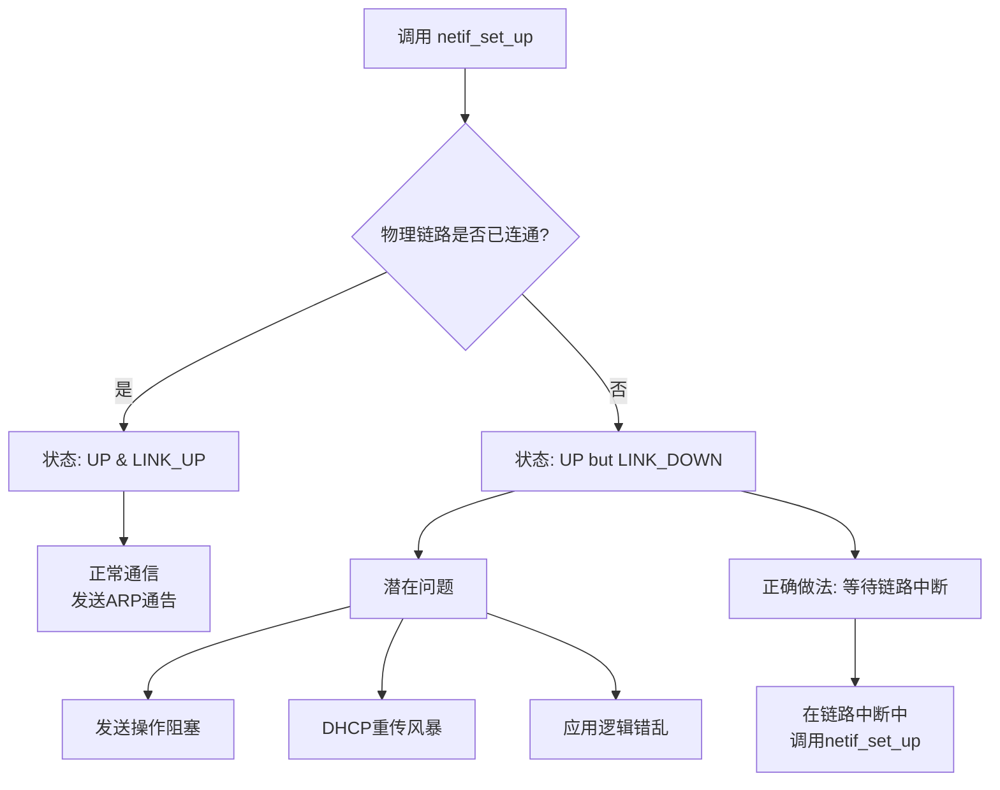

# Lwip

---



---
DHCP触发
```mermaid
flowchart TD
    A[已成功获取IP地址] --> B{触发新申请}
    B --> C[租期达到50%<br>自动续租]
    B --> D[主动执行<br>ipconfig /release & /renew]
    B --> E[重启或拔插网线<br>重新请求]

    C --> F[向原服务器发送<br>DHCP Request]
    D --> G[释放IP后<br>广播DHCP Discover]
    E --> H[广播包含原IP的<br>DHCP Request]

    F --> I{服务器响应?}
    I -- 响应ACK<br>（绝大多数情况） --> J[续租成功<br>租期更新，IP不变]
    I -- 无响应或拒绝 --> K[在租期87.5%时<br>尝试广播续租]

    G --> L[服务器选择IP]
    H --> M{原IP可用?}
    
    L --> N[优先分配原IP]
    M -- 是 --> O[分配原IP]
    M -- 否<br>（地址已分配或无效） --> P[分配新IP]

    N --> Q[IP地址保持不变]
    O --> Q
    P --> R[获得新IP地址]
    
    J --> S[最终状态：IP稳定]
    Q --> S
    R --> T[最终状态：IP变更]
  ```