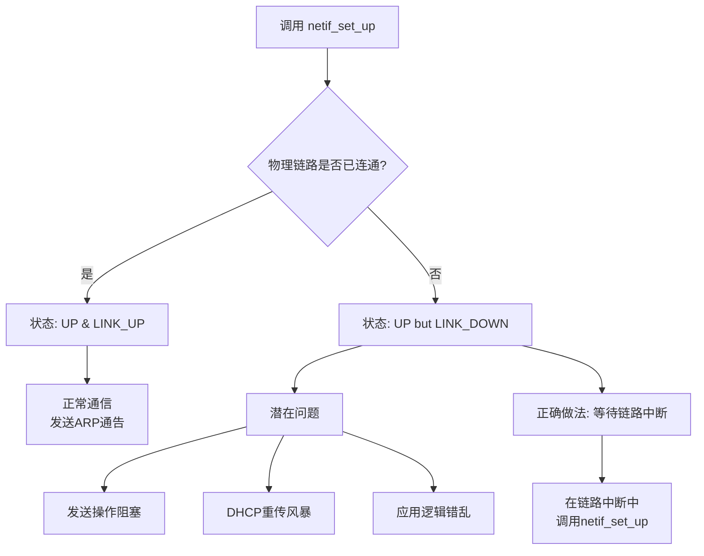

# Lwip


# 网络协议知识总结

## 一、OSI七层模型与嵌入式常用协议

OSI模型从下至上分为七层，各层在嵌入式开发中常用的协议如下：

|       层       |                               常用协议/技术                                |
| -------------- | ------------------------------------------------------------------------- |
| **物理层**     | Ethernet PHY、RS-232/485、CAN、USB、Wi-Fi、BLE、LoRa                       |
| **数据链路层** | Ethernet MAC、PPP、HDLC、CAN协议、Modbus RTU、Wi-Fi MAC、Zigbee MAC         |
| **网络层**     | IPv4/v6、ICMP、ARP、6LoWPAN、RPL                                           |
| **传输层**     | TCP、UDP、SCTP、DCCP                                                       |
| **会话层**     | TLS/SSL                                                                   |
| **表示层**     | 数据格式转换,压缩                                                           |
| **应用层**     | HTTP、MQTT、CoAP、Modbus TCP、CANopen、SNMP、DHCP、DNS、NTP、SSH、Telnet 等 |

## 二、SSH 与 Telnet 的关系

- **SSH 是 Telnet 的安全升级版**，两者均用于远程登录管理。
- **Telnet**：明文传输，无加密，易受攻击，端口23。
- **SSH**：加密通信，提供强认证，集成 SFTP/SCP、端口转发等功能，端口22。在嵌入式领域广泛使用轻量级实现（如 Dropbear）。

## 三、常见协议在 OSI 与 TCP/IP 模型中的层级

| 协议  | OSI 模型层级 | TCP/IP 模型层级 |
|-------|--------------|------------------|
| PPP   | 数据链路层   | 网络接口层       |
| ARP   | 网络层（或链路层与网络层之间） | 网络层（或网络接口层） |
| ICMP  | 网络层       | 网络层           |
| Telnet| 应用层       | 应用层           |
| DNS   | 应用层       | 应用层           |
| NTP   | 应用层       | 应用层           |
| HTTP  | 应用层       | 应用层           |
| MQTT  | 应用层       | 应用层           |

## 四、传输层主要协议

### 1. TCP（传输控制协议）
- 面向连接、可靠、字节流
- 适用场景：HTTP、FTP、SSH、MQTT（基于TCP）

### 2. UDP（用户数据报协议）
- 无连接、不可靠、数据报
- 适用场景：DNS、DHCP、NTP、RTP、CoAP

### 3. 其他传输层协议
- **SCTP**：多宿主、多流，用于电信信令
- **DCCP**：带拥塞控制的不可靠传输
- **UDP-Lite**：允许部分数据损坏

## 五、应用层协议是否需要互联网？

**不需要**。DNS、NTP、HTTP、MQTT 均可在局域网内正常工作，前提是存在对应的本地服务器：
- **DNS**：可自建 DNS 服务器或使用 hosts 文件
- **NTP**：可搭建本地 NTP 服务器同步时间
- **HTTP**：可部署内网 Web 服务器
- **MQTT**：可运行本地 Broker（如 Mosquitto）

日常依赖互联网是因为默认使用了公共服务器，而非协议本身要求。

## 六、应用层协议为何都需要服务器？

几乎所有应用层协议都采用 **客户端-服务器模型**：
- 服务器集中提供资源或服务（如 Web 页面、时间源、域名解析、消息中转）。
- Telnet 也需要服务器（`telnetd`）监听连接，提供远程 shell。
- 在 TCP/IP 模型中，**只有应用层需要服务器**；其他层（网络接口层、网络层、传输层）负责数据传输，不涉及“服务器”角色。

### 例外情况
- P2P 协议（如 BitTorrent）节点对等，但通常仍依赖追踪服务器。
- 局域网服务发现协议（如 mDNS）使用组播，无需中央服务器。

## 七、总结

- OSI 模型为理解网络分层提供参考，嵌入式开发常依据资源限制选用轻量级协议栈。
- 从 Telnet 到 SSH 的演进体现了安全性的核心地位。
- 各协议在模型中的层级划分有助于定位问题与设计系统。
- 传输层核心是 TCP 与 UDP，其他协议用于特定场景。
- 应用层协议可完全运行于局域网，无需互联网。
- 服务器概念仅存在于应用层，其他层共同构建通信基础。

---

```mermaid
flowchart TD
    A[调用 netif_set_up] --> B{物理链路是否已连通?}
    B -- 是 --> C[状态: UP & LINK_UP]
    C --> D[正常通信<br>发送ARP通告]
    B -- 否 --> E[状态: UP but LINK_DOWN]
    E --> F[潜在问题]
    F --> G[发送操作阻塞]
    F --> H[DHCP重传风暴]
    F --> I[应用逻辑错乱]
    E --> J[正确做法: 等待链路中断]
    J --> K[在链路中断中<br>调用netif_set_up]
```


---
DHCP触发
```mermaid
flowchart TD
    A[已成功获取IP地址] --> B{触发新申请}
    B --> C[租期达到50%<br>自动续租]
    B --> D[主动执行<br>ipconfig /release & /renew]
    B --> E[重启或拔插网线<br>重新请求]

    C --> F[向原服务器发送<br>DHCP Request]
    D --> G[释放IP后<br>广播DHCP Discover]
    E --> H[广播包含原IP的<br>DHCP Request]

    F --> I{服务器响应?}
    I -- 响应ACK<br>（绝大多数情况） --> J[续租成功<br>租期更新，IP不变]
    I -- 无响应或拒绝 --> K[在租期87.5%时<br>尝试广播续租]

    G --> L[服务器选择IP]
    H --> M{原IP可用?}
    
    L --> N[优先分配原IP]
    M -- 是 --> O[分配原IP]
    M -- 否<br>（地址已分配或无效） --> P[分配新IP]

    N --> Q[IP地址保持不变]
    O --> Q
    P --> R[获得新IP地址]
    
    J --> S[最终状态：IP稳定]
    Q --> S
    R --> T[最终状态：IP变更]
  ```
  

# ICMP 协议与 Ping 命令完全指南

## 1. ICMP 报文完整格式

ICMP（Internet Control Message Protocol）是网络层核心协议，用于错误报告与网络诊断。ICMP 报文封装在 IP 数据报中，协议号为 1。

### 1.1 通用 ICMP 头部结构（4 字节）

| 字段 | 长度 | 描述 |
|------|------|------|
| **类型 (Type)** | 1 字节 | 定义消息类型（例如 0=回送应答，3=目标不可达，8=回送请求，11=超时） |
| **代码 (Code)** | 1 字节 | 进一步细化类型含义（如 Type=3 时 Code=0=网络不可达，1=主机不可达） |
| **校验和 (Checksum)** | 2 字节 | 覆盖整个 ICMP 报文的 16 位反码求和，用于检测传输错误 |
| **可变内容** | 4 字节 | 因类型而异：回显请求/应答中为标识符+序号；错误报告中为 IP 头部+原始数据报前 8 字节 |
| **数据部分** | 可变 | 附加数据，如回显测试的填充数据 |

### 1.2 常见 ICMP 类型与代码

| Type | 名称 | 常见 Code | 简要描述 |
|------|------|-----------|----------|
| 0 | Echo Reply | 0 | ping 应答 |
| 3 | Destination Unreachable | 0=网络不可达，1=主机不可达，3=端口不可达 | 目标不可达 |
| 4 | Source Quench | 0 | （弃用）请求减慢发送速率 |
| 5 | Redirect | 0=网络重定向，1=主机重定向 | 告诉发送方有更优路由 |
| 8 | Echo Request | 0 | ping 请求 |
| 9 | Router Advertisement | 0 | 路由器通告 |
| 10 | Router Solicitation | 0 | 路由器请求 |
| 11 | Time Exceeded | 0=TTL 超时，1=分片重组超时 | TTL 减为 0（traceroute 使用） |
| 12 | Parameter Problem | 0=IP 头错误，1=缺少选项 | IP 报头参数错误 |
| 13 | Timestamp Request | 0 | 时间戳请求（较古老） |
| 14 | Timestamp Reply | 0 | 时间戳应答 |

### 1.3 详细字段示例：回显请求/应答（Type=8/0）

| 偏移 (字节) | 字段 | 值/示例 | 说明 |
|-------------|------|----------|------|
| 0 | Type | 8（请求）或 0（应答） | |
| 1 | Code | 0 | |
| 2-3 | Checksum | 0x4a2b | 校验和 |
| 4-5 | Identifier | 0x0001 | 通常为进程 ID，用于匹配请求和应答 |
| 6-7 | Sequence Number | 0x0001 | 序号，递增以检测丢包/乱序 |
| 8-end | Data | "hello" | 可变长度填充数据 |

## 2. Ping 命令工作原理与使用详解

### 2.1 工作流程

1. **构造报文**：填充 ICMP 回显请求（Type=8, Code=0），计算校验和，设置标识符（进程 ID）和序号。
2. **封装并发送**：将 ICMP 报文封装进 IP 数据报，记录发送时间戳。
3. **网络传输**：中间路由器转发，若 TTL 减为 0 则返回 ICMP 超时错误（Type=11）。
4. **接收与统计**：目标主机返回回显应答（Type=0），发送方计算 RTT（往返时间），统计丢包率、最小/最大/平均延迟及标准差。

### 2.2 常用 Ping 命令参数对比（Linux / macOS vs Windows）

| 功能 | Linux / macOS | Windows | 说明 |
|------|---------------|---------|------|
| 指定报文数量 | `-c 4` | `-n 4` | 发送 4 个请求后停止 |
| 间隔时间 | `-i 0.2` | 固定 1 秒 | Linux 支持小数秒（需 root 小于 0.2 秒） |
| 数据包大小 | `-s 1472` | `-l 1472` | 设置 ICMP 数据部分长度（最大 MTU=1500 时安全值为 1472） |
| Flood ping | `-f`（需 root） | 无 | 以最快速度发送，压力测试 |
| 指定 TTL | `-t 64` | `-i 64` | 设置 IP 头的 TTL 字段 |
| 记录路由 | `-R` | `-r`（常被禁用） | 记录 IP 路由（受限） |
| 不解析域名 | `-n` | 默认不解析 | 直接显示 IP |
| 单包超时 | `-W 2`（秒） | `-w 2`（总时长毫秒） | Windows 的 `-w` 是总运行时长（毫秒） |
| 输出时间戳 | `-D` | 无 | 每行前打印系统时间 |
| 绑定接口 | `-I eth0` | `-S 192.168.1.2` | 从指定接口或源 IP 发送 |

### 2.3 输出解读（Linux 示例）
