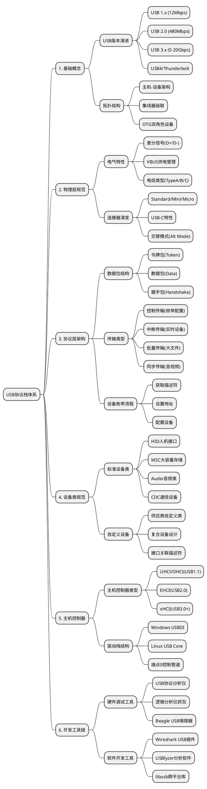

# USB协议
USB通信距离短,是不对等协议
USB设备按功能分为集线器和功能设备
USB拓展深度最多七层, <mark>2^7 = 127</mark> 个USB设备,每个设备 <mark>2^4 = 16</mark> 个端点
- 六个设备状态: 开机, 缺省, 地址, 配置, 连接, 挂起

- [USB协议解析](https://blog.csdn.net/zhoutaopower/article/details/82083043)

- 四种PID类,每个类有四个PID,共16个PID
    1. 令牌类: OUT, IN, SETUP, SOF
    2. 数据类: DATA0, DATA1, DATA2\*, MDATA\*
    3. 握手类: ACK, NACK, STALL, NYET\*
    4. 特殊类: PRE, ERR\*, SPLIT\*, PING\*

- [USB设备描述结构](https://www.cnblogs.com/chd-zhangbo/p/5249955.html)
    1. 设备描述符: <mark>一个设备仅一个</mark>设备描述符,包含了设备类型、设备遵循协议、厂商ID、产品id、序列号等
    2. 配置描述符: 一个设备<mark>同一时刻</mark>只能有一种配置生效
    3. 接口描述符: 一个interface就代表一个设备
    4. 端点描述符: USB通信的基本物理单位,一个endpiont只能承载一个方向的数据
            
- 四种传输类型: 控制传输, 中断传输, 批量传输, 同步传输
    1. 控制传输: 设置阶段, 数据阶段, 状态阶段(每个阶段包含多个事务)
    2. 中断传输: 
    3. 批量传输: 
    4. 同步传输: 
        
- 事务: 令牌包, 数据包, 握手包(<mark>包是最小传输单元,不可被打断</mark>,事务也不可被打断,传输可被打断)

|  包名  | 起始标志 | 同步标志 |    包PID     |    填充    | 校验 | 结束标志 |
| ----- | -------- | -------- | ----------- | --------- | ---- | -------- |
| 令牌包 | SOP      | SYNC     | IN/OUT      | ADDR,ENDP | CRC  | EOP      |
| 数据包 | SOP      | SYNC     | DATA0/DATA1 | DATA      | CRC  | EOP      |
| 握手包 | SOP      | SYNC     | ACK/NACK    | \         | CRC  | EOP      |

- 低速(D-) < 全速(D+) < 高速

**当一个USB设备被接入USB集线器端口后，USB设备开始被枚举，过程大概如下：**

