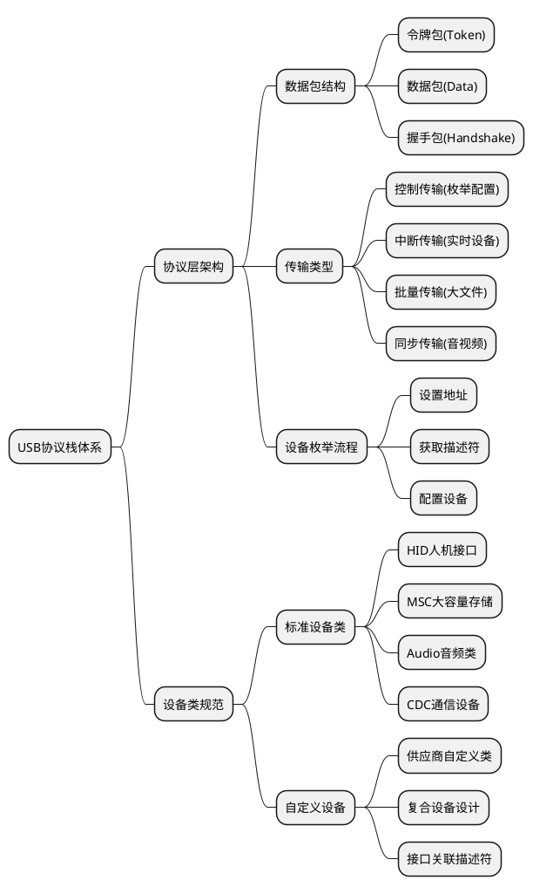

# USB协议

> [USB 2.0 详解（一）——体系结构概述](https://100ask.net/article/904)

USB通信距离短,是不对等协议
USB设备按功能分为集线器和功能设备
USB拓展深度最多七层, <mark>2^7 = 127</mark> 个USB设备,每个设备 <mark>2^4 = 16</mark> 个端点
- 六个设备状态: 开机, 缺省, 地址, 配置, 连接, 挂起

- [USB协议解析](https://blog.csdn.net/zhoutaopower/article/details/82083043)

- 四种PID类,每个类有四个PID,共16个PID
    1. 令牌类: OUT, IN, SETUP, SOF
    2. 数据类: DATA0, DATA1, DATA2\*, MDATA\*
    3. 握手类: ACK, NACK, STALL, NYET\*
    4. 特殊类: PRE, ERR\*, SPLIT\*, PING\*
> Tip: 注意三个四,四种包名,四个PID类型,每个PID类型各有四个子类

- [USB设备描述结构](https://www.cnblogs.com/chd-zhangbo/p/5249955.html)
    1. 设备描述符: <mark>一个设备仅一个</mark>设备描述符,包含了设备类型、设备遵循协议、厂商ID、产品id、序列号等
    2. 配置描述符: 一个设备<mark>同一时刻</mark>只能有一种配置生效
    3. 接口描述符: 一个interface就代表一个设备
    4. 端点描述符: USB通信的基本物理单位,一个endpiont只能承载一个方向的数据
            
- 四种传输类型: 控制传输, 中断传输, 批量传输, 同步传输
    1. 控制传输: 设置阶段, 数据阶段, 状态阶段(每个阶段包含多个事务)
    2. 中断传输: 
    3. 批量传输: 
    4. 同步传输: 
        
- 事务: 令牌包(建立阶段), 数据包(数据阶段), 握手包(状态阶段)(<mark>包是最小传输单元, 不可被打断, 事务也不可被打断, 传输可被打断</mark>)

> 事务不可以​被打断, 属于一次事务的几个包必须​​连续​​，​​不能跨帧​​完成; 传输由一次到多次事务构成，​​可以跨帧​​完成

> Tip: 一个事务有至多三个包,令牌包,数据包,握手包,其中数据包不固定长度

> Confuse:  DATA0和DATA1交替工作的意义,如何确保同步的?

>usb主机并不是每次端点传输时才知道是批量传输,而是只要是这个端点发来的数据,通过提前枚举保存的信息,就知道是批量传输

>USB结束靠“短包”​​：​​短于最大包长的数据包​​（包括零长度包）是通知接收方“数据发完了”的​​天然信号
---
>一个事务只能携带一个数据包,一次传输由多个事务组成, 应答机制有两层应答, 事务级应答 (普遍存在), 传输级应答 (特定于控制传输)

---
> 令牌包是事务的指挥官​​（指明要做什么），​​数据包是事务的搬运工​​（负责运送数据，长度可变），​​握手包是事务的质检员​​（确保数据正确送达，同步传输除外）

>USB 事务通常由​​令牌包、数据包（可选）和握手包（可选）​​ 组成, 一个PID代表一个事务

|  包名  |  -  | 起始域 | 同步域 |      PID域      |   填充域   | 校验域 | 结束域 |
| ----- | --- | ------ | ------ | -------------- | --------- | ------ | ------ |
| 令牌包 | ->  | SOP    | SYNC   | IN/OUT/SETUP   | ADDR,ENDP | CRC    | EOP    |
| 数据包 | ->  | SOP    | SYNC   | DATA0/DATA1    | DATA      | CRC    | EOP    |
| 握手包 | ->  | SOP    | SYNC   | ACK/NACK/STALL | \         | CRC    | EOP    |
|        |     |        |        |                |           |        |        |
| 帧始包 | ->  | SOP    | SYNC   | SOF            | Frame#    | CRC    | EOP    |
- 低速(D-) < 全速(D+) < 高速

**当一个USB设备被接入USB集线器端口后，USB设备开始被枚举，过程大概如下：**

- USB控制器可能包含的寄存器类别

```puml
@startmindmap
* USB协议栈体系
** 协议层架构
	*** 数据包结构
		**** 令牌包(Token)
		**** 数据包(Data)
		**** 握手包(Handshake)
	*** 传输类型
		**** 控制传输(枚举配置)
		**** 中断传输(实时设备)
		**** 批量传输(大文件)
		**** 同步传输(音视频)
	*** 设备枚举流程
		**** 设置地址
		**** 获取描述符
		**** 配置设备
** 设备类规范
	*** 标准设备类
		**** HID人机接口
		**** MSC大容量存储
		**** Audio音频类
		**** CDC通信设备
	*** 自定义设备
		**** 供应商自定义类
		**** 复合设备设计
		**** 接口关联描述符
@endmindmap
```

# USB UAC设备枚举与音频传输流程笔记

## 阶段一：枚举阶段（获取设备信息，分配地址）

| 步骤 |                主机发送                 |       设备响应        |                              说明                               |
| ---- | --------------------------------------- | -------------------- | --------------------------------------------------------------- |
| 1    | 复位信号                                | 无                   | 主机复位总线，设备进入默认状态                                     |
| 2    | GET_DESCRIPTOR (Device)                 | 返回设备描述符         | 获取基本设备信息（USB版本、VID/PID等）                             |
| 3    | SET_ADDRESS                             | 返回ACK              | 主机分配唯一地址，后续通信使用新地址                                |
| 4    | GET_DESCRIPTOR (Device)（可选）         | 返回设备描述符         | 确认地址生效                                                     |
| 5    | GET_DESCRIPTOR (Configuration)（长度9） | 返回配置描述符头       | 获取配置总长度                                                   |
| 6    | GET_DESCRIPTOR (Configuration)（全长）  | 返回完整配置描述符集合 | 包含接口、端点、类特定描述符（音频控制、音频流接口、备用设置、格式等） |
| 7    | GET_DESCRIPTOR (String)（可选）         | 返回字符串描述符       | 获取制造商、产品名等                                              |
| 8    | SET_CONFIGURATION                       | 返回ACK              | 激活配置，所有接口进入默认备用设置（Alternate Setting 0，无端点）    |

## 阶段二：配置与初始化（设置接口，准备音频流）

| 步骤 | 主机发送 | 设备响应 | 说明 |
|------|----------|----------|------|
| 9 | GET_CUR/SET_CUR（可选） | 返回/设置控制值 | 查询或设置音量、静音等控制项 |
| 10 | SET_CUR（采样频率） | 返回ACK | 设置采样率（如果设备支持多种） |
| 11 | SET_INTERFACE（Alternate Setting 1） | 返回ACK | 切换到工作接口，启用等时端点，准备音频流 |

## 阶段三：音频流传输（实时数据传输）

| 步骤 | 主机发送 | 设备响应 | 说明 |
|------|----------|----------|------|
| 12 | SOF令牌包（每1ms） | 无 | 提供时间基准，同步传输 |
| 13 | 等时OUT传输（主机→设备，扬声器）或 等时IN传输（设备→主机，麦克风） | 设备发送/接收音频数据包 | 每个帧传输一个音频帧（交织的PCM数据），无握手 |
| 14 | 中断传输（可选） | 设备上报控制事件 | 如音量旋钮变化，通过中断端点实时上报 |

## 关键点总结
- 枚举和配置均使用**控制传输**（端点0）。
- 音频数据使用**等时传输**，保证实时性但允许少量丢包。
- 备用设置0（无端点）用于空闲状态，不占用带宽。
- UAC 1.0 通过类特定描述符定义音频功能拓扑（终端、单元）。

# USB 控制传输在应用开发中的角色笔记

## 核心结论
**控制传输在持续的数据交换阶段确实很少介入，但在设备的配置、状态查询和异常处理中必不可少。**

- 数据通道（批量/中断/等时传输）负责“干活”
- 控制通道负责“指挥”和“调参”

---

## 分场景验证

### 1. CDC 串口

| 场景 | 使用的传输类型 | 控制传输是否介入 |
|:---|:---|:---|
| 正常收发数据（读写串口） | **批量传输** | ❌ 无流量 |
| 修改波特率 | **控制传输**（SET_LINE_CODING） | ✅ 介入 |
| 设置 DTR/RTS 信号 | **控制传输**（SET_CONTROL_LINE_STATE） | ✅ 介入 |
| 发送 Break 信号 | **控制传输**（SEND_BREAK） | ✅ 介入 |

**结论**：如果永远不改波特率和信号线，控制端点在数据传输时完全空闲。

---

### 2. UAC 音频

| 场景 | 使用的传输类型 | 控制传输是否介入 |
|:---|:---|:---|
| 正常播放/录音 | **等时传输** | ❌ 无流量 |
| 拖动音量滑块 | **控制传输**（SET_CUR 到特征单元） | ✅ 介入 |
| 切换采样率 | **控制传输**（SET_CUR 到采样频率控制） | ✅ 介入 |
| 切换接口备用设置 | **控制传输**（SET_INTERFACE） | ✅ 介入 |

**结论**：如果永远不改音量、采样率和接口，控制端点在音频流期间完全空闲。

---

### 3. MSC 存储

| 场景 | 使用的传输类型 | 控制传输是否介入 |
|:---|:---|:---|
| 正常读写文件 | **批量传输**（CBW/数据/CSW） | ❌ 无流量 |
| 设备插入时获取 LUN | **控制传输**（GET_MAX_LUN） | ✅ 介入 |
| 设备出错复位 | **控制传输**（BULK-ONLY MASS STORAGE RESET） | ✅ 介入 |
| 弹出设备 | **控制传输**（同步操作） | ✅ 介入 |

**结论**：如果设备永远不犯错、不被弹出，控制端点在读写期间完全空闲。

---

### 4. HID 设备

| 场景 | 使用的传输类型 | 控制传输是否介入 |
|:---|:---|:---|
| 正常上报数据（鼠标移动） | **中断传输** | ❌ 无流量 |
| 获取报表描述符 | **控制传输** | ✅ 介入（枚举阶段完成） |
| 设置空闲速率 | **控制传输**（SET_IDLE） | ✅ 介入 |
| 设置 LED 指示灯（Caps Lock） | **控制传输**（SET_REPORT） | ✅ 介入 |

**结论**：如果永远不设置指示灯、不修改空闲速率，控制端点在数据上报期间完全空闲。

---

## 总结对比表

| 设备类 | 数据通道（主要传输） | 控制通道介入时机 |
|:---|:---|:---|
| **CDC 串口** | 批量传输 | 改波特率、改信号线、发 Break |
| **UAC 音频** | 等时传输 | 改音量、改采样率、切换接口 |
| **MSC 存储** | 批量传输 | 查询 LUN、复位、弹出 |
| **HID 设备** | 中断传输 | 设置空闲速率、设置指示灯 |

---

## 核心结论
**在正常工作状态下，控制传输确实大部分时间处于闲置状态。**

- 它就像设备的 **“配置面板”** 或 **“控制开关”**，平时不用碰
- 只有在需要**调整参数、查询状态或处理异常**时才去操作
- 真正“干活”的数据，都走专用的**批量、中断或等时端点**

因此，你的理解完全正确：控制传输在设备正常工作时大部分是用不到的，只在配置和参数改变时按规范发送。

# USB 开发难度排名笔记

## 一、USB 四种传输类型难度排名

从易到难：**中断传输 < 批量传输 < 控制传输 < 等时传输**

| 排名 | 传输类型 | 难度 | 核心难点 | 典型应用 |
|:---|:---|:---|:---|:---|
| 1 | **中断传输** | ⭐ 最简单 | 基本的数据搬移，无特殊要求 | 鼠标、键盘（HID） |
| 2 | **批量传输** | ⭐⭐ 简单 | 缓冲区管理，大数据流处理 | U盘（MSC）、串口（CDC） |
| 3 | **控制传输** | ⭐⭐⭐ 中等 | 协议状态机，解析标准/类/厂商请求 | 枚举、配置、调参 |
| 4 | **等时传输** | ⭐⭐⭐⭐ 最难 | 实时性保障，时钟同步，无重传机制 | 音频（UAC）、视频（UVC） |

### 详细说明

#### 中断传输（最简单）
- **逻辑简单**：主机定时轮询，设备准备好数据即可
- **可靠**：有握手重传，不会丢数据
- **数据量小**：通常 ≤64 字节，缓冲区管理简单
- **调试容易**：事务规律，易于观察

#### 批量传输（简单）
- **协议直接**：有数据就发，没数据就等，利用空闲带宽
- **可靠**：完整握手和重传机制
- **难点**：大数据流时的缓冲区管理（属于应用层，USB协议本身简单）

#### 控制传输（中等）
- **协议最复杂**：分三阶段（设置、数据、状态），需严格遵循状态机
- **必须解析请求**：处理 8 字节设置包，区分标准/类/厂商请求
- **零长度包处理**：状态阶段需正确处理 ZLP
- **为什么不是最难**：没有实时性要求，可慢慢处理

#### 等时传输（最难）
- **无握手无重传**：数据丢了就丢了，无法补救
- **时序敏感**：必须严格遵循 SOF 周期（1ms 或 125μs）
- **时钟同步**：UAC 2.0 需实现反馈端点，PID 控制算法调频
- **带宽计算**：需精确计算每帧字节数
- **调试困难**：问题偶发（如几分钟爆音一次），难复现

---

## 二、USB 四类设备开发难度排名

从易到难：**HID < CDC < MSC < UAC**

| 排名 | 设备类 | 难度 | 核心难点 | 主要传输类型 |
|:---|:---|:---|:---|:---|
| 1 | **HID** | ⭐ 最简单 | 报表描述符（有模板可抄） | 中断传输 |
| 2 | **CDC** | ⭐⭐ 简单 | 双接口模型，处理 SET_LINE_CODING | 批量传输 |
| 3 | **MSC** | ⭐⭐⭐ 中等 | SCSI 命令解析，块存储协议 | 批量传输 |
| 4 | **UAC** | ⭐⭐⭐⭐ 最难 | 实时性，时钟同步，描述符拓扑复杂 | 等时传输 |

### 详细说明

#### HID（最简单）
- **无驱动**：操作系统内置驱动
- **报表描述符**：唯一学习曲线，但有标准模板可抄
- **数据量小**：中断传输，每次几个字节
- **适合入门**：快速跑通 USB 通信

#### CDC（简单）
- **抽象模型**：需理解“通知接口+数据接口”复合结构
- **关键请求**：需处理 SET_LINE_CODING（设置波特率）
- **数据透传**：USB 包 ↔ UART 字节流的转换

#### MSC（中等）
- **SCSI 命令**：需处理 READ(10)、WRITE(10)、INQUIRY 等
- **文件系统（上层）**：USB 只读写 LBA，但需配合主机文件系统
- **性能与稳定**：批量传输，数据必须准确无误
- **缓冲区管理**：处理大吞吐量

#### UAC（最难）
- **等时传输**：实时性要求极高，不能卡顿
- **时钟同步**：
  - UAC 1.0：依赖 SOF 同步
  - UAC 2.0：需实现反馈端点，PID 控制算法
- **描述符拓扑复杂**：需定义输入/输出终端、特征单元等
- **调试困难**：通常需要 USB 协议分析仪

---

## 三、传输类型与设备类的对应关系

| 传输类型 | 主要应用的设备类 | 开发难度 |
|:---|:---|:---|
| 中断传输 | HID | ⭐ 最简单 |
| 批量传输 | CDC, MSC | ⭐⭐ 简单 ~ ⭐⭐⭐ 中等 |
| 控制传输 | 所有设备（枚举、配置、类请求） | ⭐⭐⭐ 中等 |
| 等时传输 | UAC, UVC | ⭐⭐⭐⭐ 最难 |

---

## 四、核心规律总结

1. **传输类型决定设备类的底层难度**
   - 使用中断/HID：最简单
   - 使用批量/CDC、MSC：中等
   - 使用等时/UAC：最难

2. **实时性要求越高，开发难度越大**
   - HID/CDC/MSC：可以等，有重传
   - UAC：不能等，无重传

3. **协议栈成熟度影响开发体验**
   - HID/CDC/MSC：有大量现成例程和库
   - UAC：完整实现较少，需要深入理解协议

4. **调试工具需求递增**
   - HID/CDC：万用表+逻辑分析仪够用
   - MSC：需要能抓取 SCSI 命令的工具
   - UAC：必须要有 USB 协议分析仪

---

## 五、开发路线建议

| 阶段 | 推荐学习内容 | 目标 |
|:---|:---|:---|
| 入门 | HID（中断传输） | 理解 USB 枚举和基本数据传输 |
| 进阶 | CDC 虚拟串口（批量传输） | 掌握数据流和缓冲区管理 |
| 深入 | 控制传输 + MSC | 吃透 USB 协议栈和 SCSI 命令 |
| 挑战 | UAC 麦克风（等时传输） | 攻克实时性和时钟同步难题 |

**注**：如果项目需要同时开发 UAC 和 UVC（音视频复合设备），难度会叠加，建议先分开实现再整合。