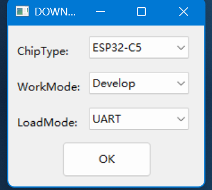
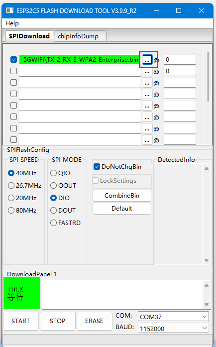
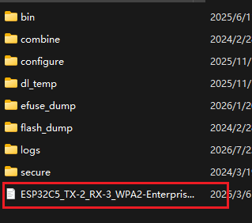
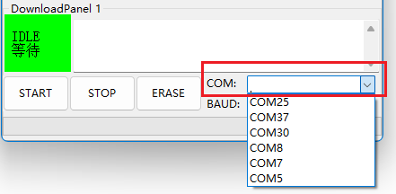
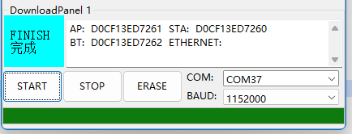

## 一、工具:
- 软件: 
1. usblogview(确认端口号)

2. flash_download_tool(下载工具)

- 硬件:
1. 串口工具(下载工具)

2. 公对母杜邦线

3. 电路板

# 二、流程

1. 杜邦线对齐串口工具插入电路板,<mark>线序为对应颜色的杜邦线对齐插入</mark>

2. 打开usblogview, 串口工具插入电脑, 会提示什么设备插入电脑,寻找记录对应的端口号

4. 用typec口给设备电路板供电,<mark>注意一定是用电脑接typec给设备供电,并且是先插入烧录工具最后在给设备供电</mark>

5. 打开flash_download_tool下载工具,选择ESP32C5, OK确定

6. 选择需要烧录的固件

7. 选择第3步usblogview确定的端口号

8. 电机START开始下载,然后等待下载完成, 结束, 如下
