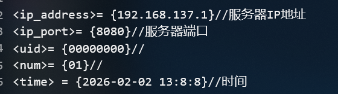
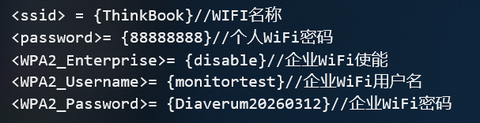
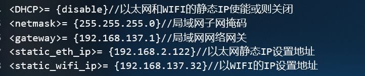

# 配置说明

- **配置模板**
```
<ip_address>= {192.168.137.1}//服务器IP地址
<ip_port>= {8080}//服务器端口
<uid>= {00000000}//
<num>= {01}//
<time> = {2026-02-02 13:8:8}//时间

<ssid> = {ThinkBook}//WIFI名称
<password>= {88888888}//个人WiFi密码
<WPA2_Enterprise>= {disable}//企业WiFi使能
<WPA2_Username>= {monitortest}//企业WiFi用户名
<WPA2_Password>= {Diaverum20260312}//企业WiFi密码

<DHCP>= {disable}//以太网和WIFI的静态IP使能或则关闭
<netmask>= {255.255.255.0}//局域网子网掩
<gateway>= {192.168.137.1}//局域网网络网关
<static_eth_ip>= {192.168.2.122}//以太网静态IP设置地址
<static_wifi_ip>= {192.168.137.32}//以WIFI的IP设置地址

<WIFI>= {enable}//WiFi使能
<LAN>= {disable}//以太网使能

[wifi_mac] = {xx:xx:xx:xx:xx:xx}//导出数据,wifi mac地址无需设置
[eth_mac] = {xx:xx:xx:xx:xx:xx}//导出数据,eth mac地址无需设置
```
- **灯状态说明,辅助网络判断**
1. 黄灯闪烁,代表网络未连接,如WIFI和以太网
2. 绿灯闪烁,代表网络已连接,网络正常
3. 黄灯常亮,代表正在治疗,但是服务器未连接
4. 绿灯常亮,代表只在治疗,服务器连接正常


# 特定网络填写参考
## 1. **普通WIFI普通以太网动态IP仅需填写以下内容**
---


## 2. **普通WIFI静态IP**
---


## 3. **企业WIFI静态IP**
---


## 4. **以太网静态IP**
---


# 通用流程
> **第一步**: 首先设置通用的`设备信息`, `服务器地址`


---

> **第二步**: 根据客户的wifi情况选择是适用`企业wifi`还是`个人wifi`

> - 若为`企业WiFi`, 则需在`<WPA2_Enterprise>`字段输入`enable`,否则输入`disable`
> - 若为`企业WIFI`, 则下面的`<WPA2_Username>`和`<WPA2_Password>`字段可忽略,不用填写,填写设备也不会识别

---


> **第三步**: 选择`动态IP`地址分配还是,客户选定的`静态IP`地址分配

> - 若为`动态分配`则填写`enable`, 若为`静态IP分配`,则填写`disable`
> - 若为`动态IP分配`, 则下面的`<netmask>`和`<gateway>`, `<static_eth_ip>`, `<static_wifi_ip>`字段可忽略,不用填写,填写设备也不会识别
> - 若为`静态IP分配`, 则需按照医院的网络情况填写`网关`和`子网掩码`, 和指定的`静态IP地址`
> - **注意!!!** 以太网ETH和无线网WIFI不能分配填写同一个IP地址,一般来讲二者只需选用一个

---

> **第四步**: 根据网络需求选择启用`无线网WIFI`还是`以太网ETH`

> - 可根据需求选择启用的网络, 二者可同时使用,但是<mark>同时开启且为静态IP地址分配时,二者静态IP不能设置为同一个</mark>

---

> **设备信息导出**: 此段不用填写可忽略
> 
> 若为设置**静态IP**时, 医院可能会要求提供设备`MAC地址`
> 当设置为`静态IP`时,会导出对应设备的WIFI`无线网MAC地址`和ETH`以太网MAC地址`