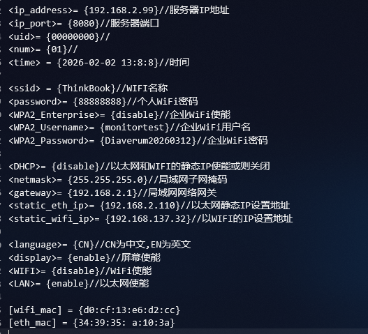

## 示例配置

## 服务器准备工作
1. 在设备将要连接的网络环境下, Ping命令服务器IP地址,确保服务器在同一个网络环境

2. Telnet命令服务器的端口,确保服务器端口开放能够正常访问

3. 和医院服务器确认防火墙开放,加入医院网络环境白名单

## 设备端配置工作

1. 若为无线连接,连接上医院提供的WIFI,进入命令行窗口,ipconfig查看无线网络的子网掩码,网关等,确保正确
若为有线连接,以太网插入电脑(若有网口),同样命令行窗口,ipconfig查看有线网络的子网掩码,网关等,确保正确

2. 将上述信息填入配置文件,重新配置

3. 配置好设备网络环境后,等待一段时间
- 观察设备的指示等,若为黄灯则wifi未连接或则以太网未连接
- 同一个网络环境下用笔记本电脑PING设备设置的静态IP地址,看是否响应,判断是否连接上局域网

4. 若未连接,确认配置文件未配置错误, 为防止多余信息干扰,可将配置文件的多余无用字段删除
<mark>注意: 不要删除`使能字段`如disable或则enable,仅删除`数据字段`如static_wifi_ip, ssid, WPA2_Username</mark>

5. 向医院确定网络环境准入条件是否满足

6. 指示等绿灯闪烁后,代表设备端网络连接正常

7. 网络连接正常后, 等待10min闪烁后进入治疗阶段, 若为绿灯则通信正常,设备安装结束

8. 网络连接正常后, 等待10min闪烁后进入治疗阶段, 若为黄灯,则代表网络连接成功,但是服务器并未正常连接
此时,需和医院确认服务器白名单是否加入, 是否限制了服务器的端口访问